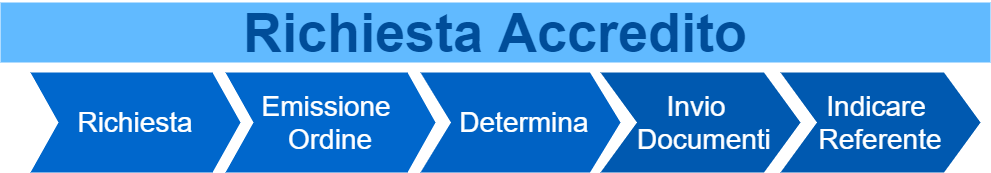

.. _Come_muovere_primi_passi:

**Come muovere i primi passi**
******************************

Per inizare a utilizzare la piattaforma **Nivola**
è necessario procedere seguendo i seguenti passaggi.

    1. **Richiedere Accredito** [1]_
    2. **Ricevere Accredito** [2]_
    3. **Completare i Livelli Organizzativi** [3]_
    4. **Attivare Utenti** [4]_
    5. **Verificare Security Group** [5]_
    6. **Istanziare Servizi** [6]_

.. image:: img/Primi_Passi.png

.. [1]

**Richiedere Accredito**
========================

Per poter utilizzare i servizi esposti dalla piattaforma Nivola è necessario accreditarsi secondo il seguente processo:

    1. Fare  una richiesta formale al Csi-Piemonte tramite i canali stabiliti.
    2. Dopo avere ricevuto l’offerta ufficiale protocollata, procedere
       con l’emissione di un ordine al CSI-Piemonte.
    3. Approvare e impegnare con una determina l’importo presente nell’offerta.
    4. Inviare la documentazione tramite PEC all’indirizzo protocollo@cert.csi.it
       indicando nell’oggetto dell’email:
        a) Attivazione Servizi Nivola.
        b) Numero di protocollo presente sull’offerta.
        c) Nome dell’Ente.
    5. Indicare un referente che sarà contattato dal nostro servizio di assistenza per i dettagli tecnici. Nel caso in cui  la persona cui rivolgersi, in caso di incident di sicurezza, sia diversa da quella indicata in precedenza, serve individuare un nominativo diverso, in ottemperanza alle norme di ultima introduzione in ambito di Data Breach.

Questi aspetti sono riportati nel manuale utente del servizio e nelle condizioni generali in cui è possibile trovare
maggiori dettagli e informazioni anche inerenti la cessazione del servizio. Nel caso si presentasse questa evenienza
 il CSI si impegna a mettere a disposizione del Cliente i propri dati e successivamente di cancellarli.

.. [2]

**Ricevere Accredito**
======================

Il primo passo per fruire dei servizi della piattaforma
è ricevere dal supporto la comunicazione via e-mail del **primo accredito**.
In questo modo l'utente accreditato,
sarà in grado di controllare la struttura organizzativa modellata dal Supporto e
conferire ulteriori abilitazioni.

.. [3]

**Completare i Livelli Organizzativi**
======================================

La piattaforma si compone di 3 livelli organizzativi quello deputato ad ospitare i servizi è
l'**account**.  Nel caso, l'**account** non fosse stato definito dal supporto, prima di crearlo sarà indispensabile
individuare o creare una **Divisione** da cui farlo dipendere. La presenza dell'**Organizzazione**
e della **Divisione** sono la condizione necessaria alla generazione dell'**account**.

.. [4]

**Attivare Utenti**
===================

Successivamente ad aver costituito la struttura organizzativa,
sarà possibile indicare a **Nivola*** gli **utenti** associati a **ruoli**
che ad ogni livello, potranno agire sugli oggetti con compiti specifici.

.. [5]

**Verificare Security Group**
=============================

In ogni **account** saranno istanziati i **servizi**. Per garantire la sicurezza e la connettività
dell'infrastruttura sarà indispensabile controllare che i **Security Group**, in dotazione all'**account**, rispondano
alle esigenze. Qualora servisse, i **security group**, potranno essere modificati. La piattaforma
permette di modellare i **firewall** in base alle necessità
dell'infrastruttura da dispiegare nell'account.

.. [6]

**Istanziare Servizi**
======================
Conclusi tutti i passaggi precedenti sarà possibile attivare i **servizi**. La piattaforma **Nivola**,
attraverso il portale, mette a disposizione gli strumenti utili a
**creare/modificare/cancellare/monitorare** le entità che compongono l'infrastruttura
da ospitare.

