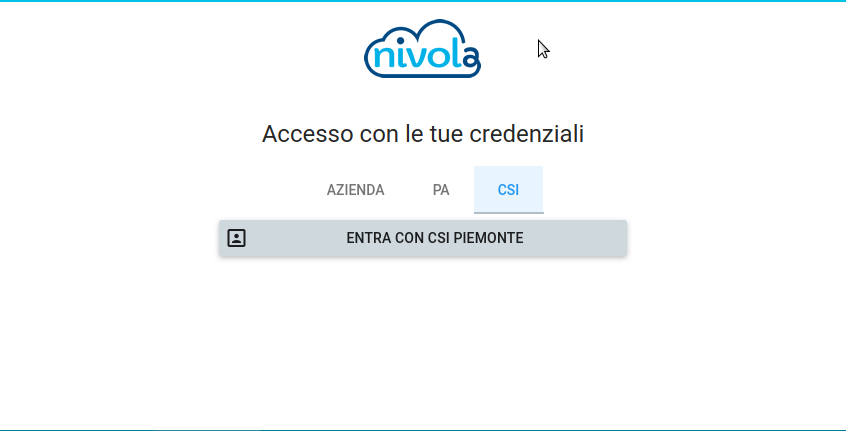
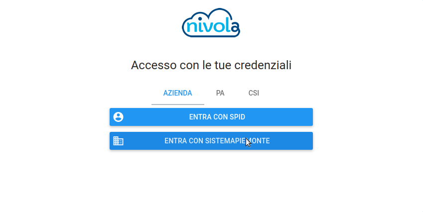
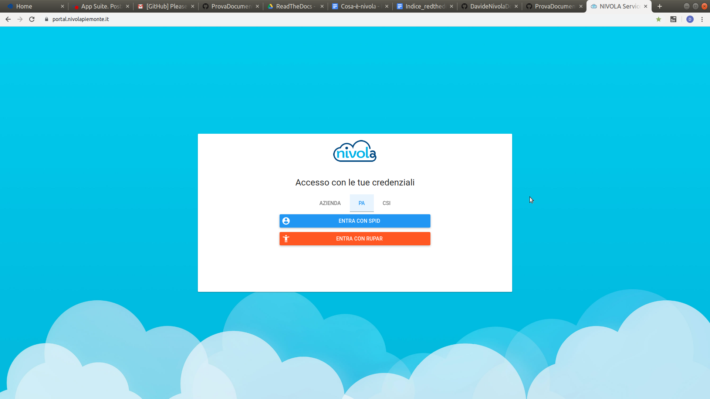

.. _Lavorare_con_compute_service:

**Lavorare con Compute Service**
********************************
Nivola è una piattaforma completamente open source
che semplifica l’utilizzo dei servizi cloud da parte della pubblica amministrazione.
Nivola è realizzata dal CSI Piemonte e mette a disposizione potenza di calcolo, storage, rete e database e molto altro. Il risultato è quello di offrire a ogni amministrazione la completa autonomia nella creazione del proprio sistema informativo e nella migrazione delle applicazioni, in assoluta sicurezza. I servizi sono facilmente scalabili, senza spese di licenza e di gestione dell’hardware.  Ogni ente può quindi creare in autonomia il proprio sistema informativo, pagando esclusivamente in base all’utilizzo, attraverso sistemi di rilevazione dei consumi .

Accesso al Portale
-------------------

Per accedere allo **user portal** (interfaccia di gestione di Nivola) è necessario inserire, nel proprio browser, la seguente URL: https://portal.nivolapiemonte.it/.

L’accesso allo user portal avviene mediante autenticazione. Attualmente sono previste tre tipologie di autenticazione :

- CSI (credenziali di CSI Piemonte)

- Azienda (credenziali di di SPID o Sistema Piemonte per la pubblica amministrazione)

- Pubblica amministrazione (credenziali di SPID o RUPAR)

Servizi
-------
La piattaforma espone diversi Servizi, utilizzabili a seconda del ruolo con cui si accede:

1. Compute dove è possibile creare, clonare stoppare, attivare e cancellare le Virtual Machine.

    1. **Creare VM** :ref:` Creare VM <_Creare_VM>`.
    2. **Gestire VM** :ref:`vedi Gestione VM <_Gestire_VM>`.
    3. **Usare VM** :ref:`vedi Usare le VM <_Usare_VM>`.
    4. **Creare chiavi ssh** :ref:`vedi creare chiavi ssh <_Creare_chiavi_ssh>`.
    5. **Importare chiavi ssh** :ref:`vedi importare chiavi ssh <_Importare_chiavi_ssh>`.

2. Database: consente di fruire dei servizi di database su differenti
tecnologie e con differenti flavors (caratteristiche del servizio in termini di
CPU, RAM e disco):

    1. **Creare istanze del DBAAS** :ref:`vedi creazione DBAAS <_Creare_DBAAS>`.;

    2. **Gestire istanze del DBAAS** :ref:`vedi gestione DBAAS <_Gestire_DBAAS>`.;

    3. **Usare istanze del DBAAS** :ref:`vedi Usare il proprio DBAAS <_Usare_il_proprio_DBAAS>`.;

3. Reti e Sicurezza: insieme di funzioni necessarie alla gestione delle risorse di rete,
della sicurezza, della microsegmentazione, di bilanciamento applicativo sia locale
che geografico, di gestione dei nomi DNS statici e dinamici:

    1. **Creare Security Group** :ref:`vedi creazione SG <_Creare_Security_Group>`.;
    2. **Gestire le regole del Security Group** :ref:`vedi Gestione SG <_Gestione_Regole_SG>`.;

4. Storage: permette di accedere a uno spazio disco con protocolli NFS e CIFS  ed è integrato con gli altri servizi previsti
dalla piattaforma o con altri servizi installati dal consumer.

    1. **Creare Storage as Service** :ref:`vedi creazione STAAS <_Creare_STAAS>`.;
    1. **Gestire Storage as Service** :ref:`vedi gestione STAAS <_Gestire_STAAS>`.;
    1. **Usare il proprio Storage as Service** :ref:`vedi usare il proprio STAAS <_Usare_il_proprio_STAAS>`.;

4. Interagire con il **Nivola Support Center**:

5. Attivare il **Nivola Support Center**:

