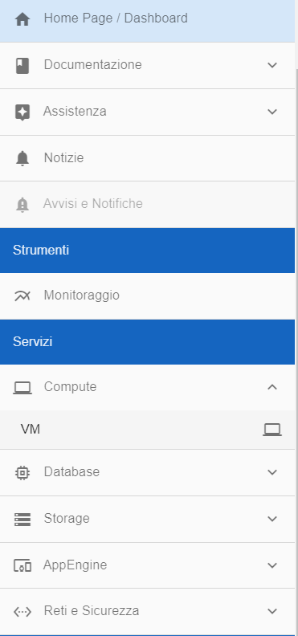
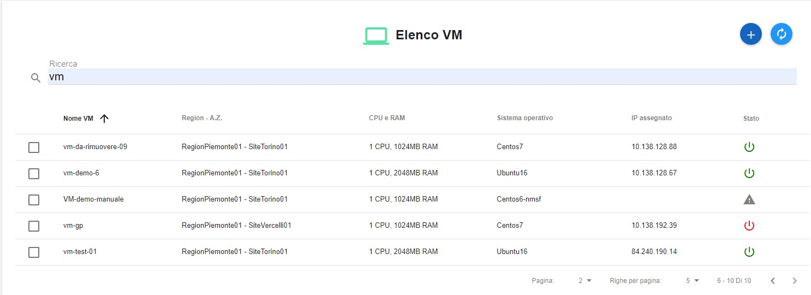
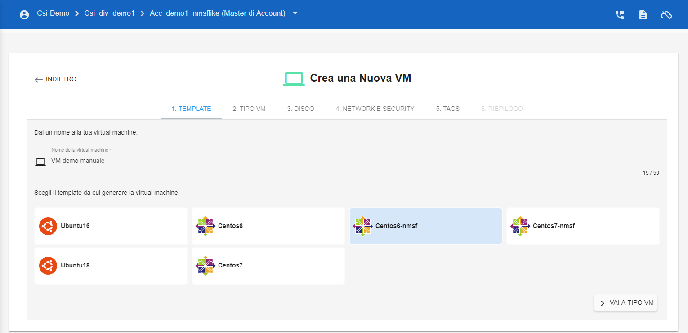
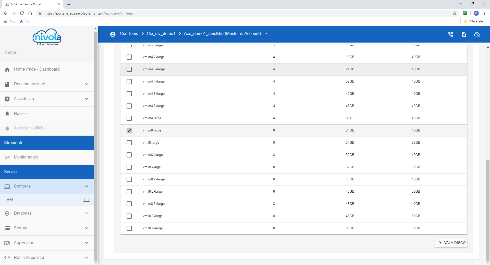
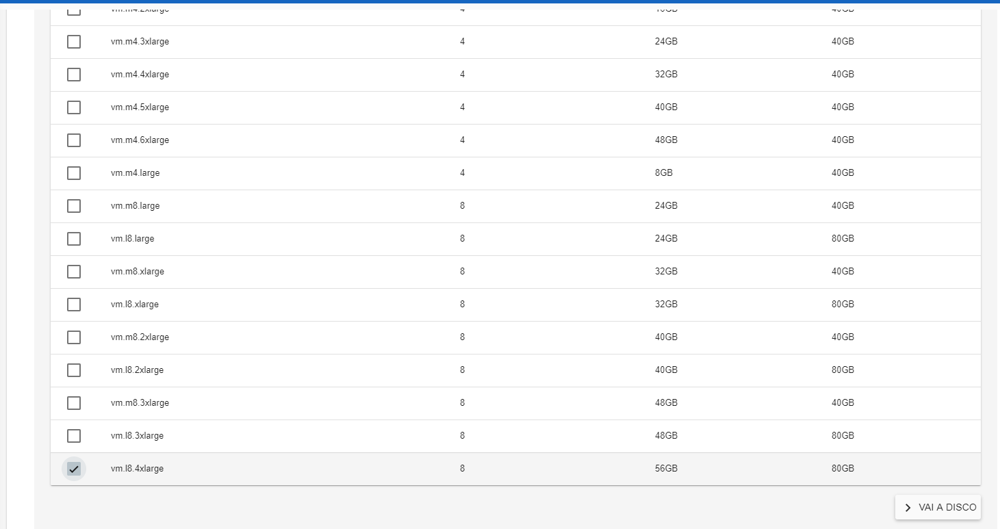
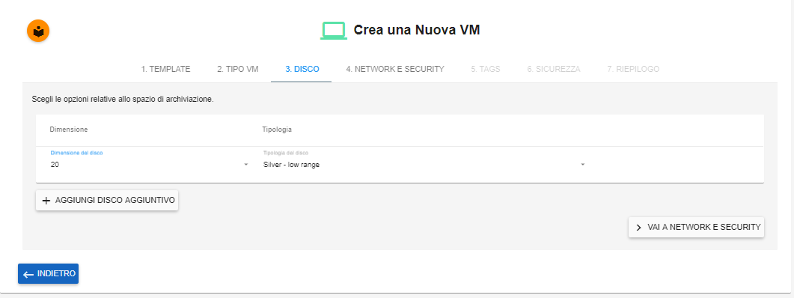
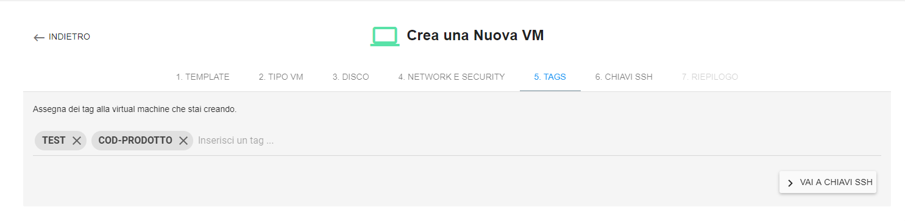
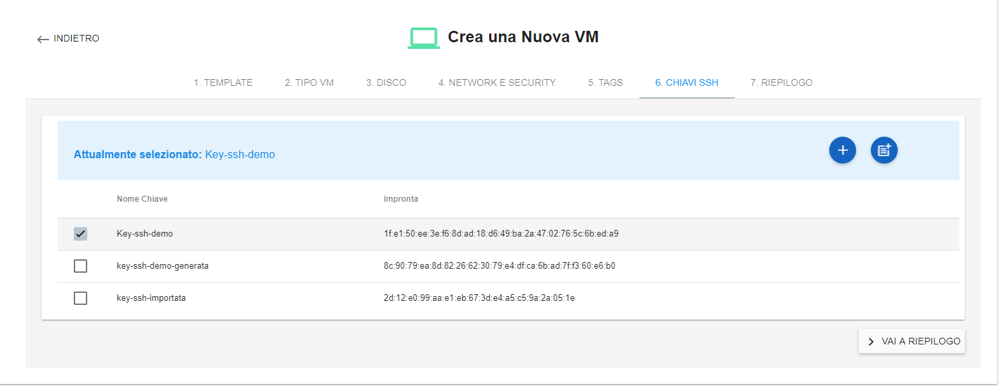
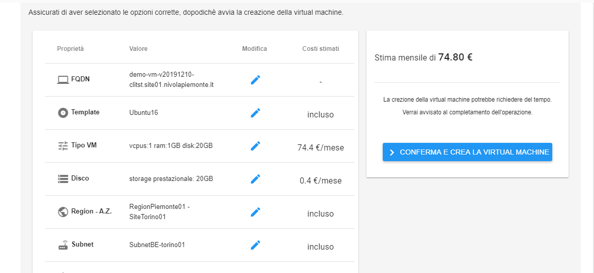
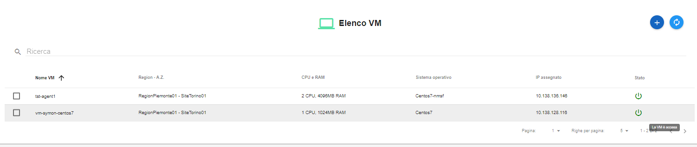

.. _Creare_VM:

**Creare Virtual Machine (VM)**
===============================
La funzione rientra nel **servizio compute**. La **creazione Vm** è attivabile dalla parte
sinistra dello schermo, cliccando sulla label **VM** sotto **Compute**

A seguito di un clic su **VM**, il sistema popolerà la
parte destra del video con l'**Elenco delle VM**.

Per la creazione di un server, procedere come segue:

1. Fare clic sul pulsante **"+""**:

.. image:: img/Add_VM.png

2. Inserire il **Nome della virtual machine** nella textbox;

.. code-block:: Regole di Naming

    $ Queste indicazioni sono vincolanti solo per gli account dell'Organizzazione CSI

      Per i nomi da assegnare ai Server il modello da seguire è < ambiente >-< middleware >< n >-< codice prodotto >:

        ambiente  : Il campo evidenzia solo quelli diversi da produzione (dev, tst, coll).
        middleware; prevede i seguenti valori jboss, tomcat, wf (web server internet), wfrupar (web server rupar),
        Nel caso la Vm sia  DB NON as-a-service si utilizzerano questi nomi: Postgresql --> pg e MySQL --> mysql.
        I nomi dei DB as-a-service sono assegnati dal gruppo di supporto.
        Il valore numerico (n) serve per distinguere i sistemi con la stessa funzione.
        Il campo codice prodotto è il codice prodotto riportato sulle anagrafiche aziendali (10 caratteri).

3. Scegliere il **TEMPLATE** da cui generare la virtual machine facendo un clic su uno degli OS propposti come pulsanti
e successivamente sul pulsante **VAI TIPO VM**;

4. Specificare il type, la CPU, la RAM e il Disco sfruttando il **CheckBox** in testa ad ogni riga esposta
dal portale e di seguito cliccare il pulsante **VAI A DISCO**;

5. Indicare dimensione del disco ed eventualmente, aggiungere altri dischi,
sfruttando il pulsante **AGGIUNGI DISCO AGGIUNTIVO**. Al termine,
proseguire cliccando su **VAI A NETWORK E SECURITY**;

6. Sfruttando le combo box, proposte da Nivola, inserire: **Region, Availability Zone,
Subnet e Gruppo di sicurezza**.  Al termine cliccare su **VAI A TAGS**;

7. Nel caso servissero, è possibile assegnare dei tag alla virtual machine,
scrivendoli nella casella di testo e premendo invio.
E' possibile eliminare quanto inserito in precedenza, cliccando la **"X"**
a fianco dei tags da cancellare. Alla fine, proseguire premendo **VAI A CHIAVI SSH**;

8. In questa fase è obbligatorio generarare una **CHIAVE SSH** da associare alla
virtual machine, per farlo, Nivola mette a disposizione 3 metodi;

**SCEGLIENDO UNA DELLE CHIAVI DALLA LISTA**
Con questa soluzione il sistema propone una serie di **chiavi ssh** da cui scegliere.
L'operatore potrà individuare la chiave sfruttando la checkbox
e successivamente, premere **VAI A RIPEILOGO**;

**CREANDO CHIAVE SSH EX NOVO**
Con questo metodo si chiede al sistema di generare direttamente una
nuova **chiave ss**;

Il processo inizia premendo il tasto **"+"**

.. image:: img/Add_VM.png

Nella casella di testo,**Inserire nome della nuova chiave** e premere **CREA CHIAVE**
dopo di che distinguerla nella lista e premere **VAI A RIPEILOGO**;

**IMPORTANDO LA CHIAVE SSH**

Premere il tasto per la "creazione"

.. image:: img/Crea-ssh-da-lista.png

**Inserire il nome chiave**, immettere la chiave precedentemente generata
nel campo di testo  **Inserire la chiave** e
premere **IMPORTA**;

.. image:: img/Importa-key-ssh.png

Conclusa la generazione della **chiave ssh**, utilizzare la checkbox per
selezionarla dalla lista e premere **VAI A RIPEILOGO**;

9. Controllare gli attributi del server da creare
e validarli premendo sul pulsante **CONFERMA E CREA LA VIRTUAL MACHINE**.
Il portale procederà alla creazione della **VM** utilizzando i parametri
inseriti dall'operatore;

10. Attendere qualche secondo e il server, comparirà nell’**ELENCO VM**.
Lo stato iniziale della **Virtual Machine** sarà **acceso** e
quindi disponibile.

