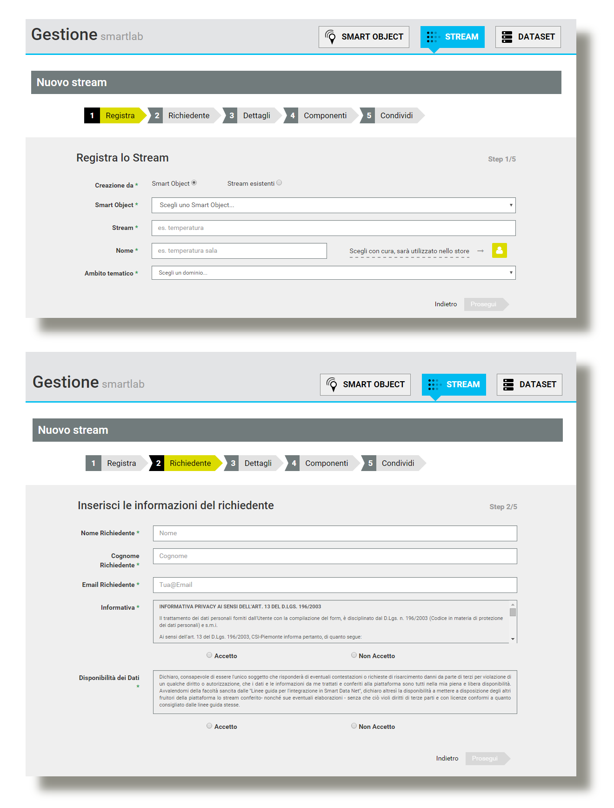

.. _sensori_app:

**Collegare sensori e applicazioni**
************************************

YUCCA consente la fruizione dei dati in essa memorizzati e/o elaborati in varie modalità.  Per l’invio, tramite servizi, dei dati testuali associati ad un sensore o ad un’applicazione, si utilizzano principalmente MQTT(S) e http(S).

Per ulteriori informazioni riguardo ai protocolli supportati da Yucca visita :ref:`questa pagina <protocolli_supportati>` .

.. image:: img/Collegare_Sensori1.png

**MQTT (Message Queuing Telemetry Transport)** è un protocollo di messaggistica leggero, studiato per dispositivi limitati in termini di risorse (cpu, memoria) che operano su reti a bassa largheza di banda e ad alta latenza. Implementa il paradigma publish/subscribe.

**Http(S)** è il protocollo utilizzato per le normali comunicazioni sul web. In SDP vengono esposti dei servizi http(s) sui quali inviare i dati.

**Come collegare i sensori e le applicazioni**
==============================================

Con la piattaforma è possibile censire, a scopo di sperimentazione, i propri sensori e le proprie applicazioni richiedendo un'area di lavoro o un tenant trial nel caso si desideri fare una prova. 

Per censire il proprio sensore, richiederne l’installazione ed iniziare ad inviare dati è necessario autenticarsi sullo user portal (fai click :ref:`qui <user_portal>` per il tutorial per l'accesso allo User Portal)

Dopo l’accesso comparirà il menù principale del portale:

.. image:: img/Collegare_Sensori2.png

Per censire il proprio sensore o la propria applicazione, selezionare “Crea Smart Object”:

Inserire le informazioni richieste e premere il pulsante “Crea Smart Object”.

.. image:: img/Collegare_Sensori3.png

Inserire:

•	Tipo: Device (se si tratta di un sensore) o Application (se si tratta di un’applicazione).
•	Codice: Premere il pulsante genera oppure inserire il codice del proprio sensore (vedi prassi per la generazione del codice).
•	Categoria: Scegliere tra i valori possibili quello che meglio rappresenta l’oggetto da collegare.
•	Nome: Indicare un nome parlante
•	Descrizione: Inserire una descrizione sommaria dell’oggetto Inserire eventuali altre informazioni (per il tutorial sono sufficienti quelle di default) e premere il pulsante “Salva”.

Il sensore o l’applicazione  viene censito nel sistema.

**Come censire il flusso**
==========================

A questo punto è necessario creare uno o più stream da associare al sensore o all’applicazione. Per fare ciò è possibile selezionare il pulsante “**Crea Stream**” dal menù principale dello user portal oppure tramite il pulsante “**+ nuovo**” nella schermata di gestione del proprio tenant.

.. image:: img/Collegare_Sensori4.png

Nella schermata che compare inserire le informazioni descrittive dello stream.

.. image:: img/Collegare_Sensori6.png

Al fine di consentire la massima elasticità del modello, su Yucca ogni smart object può inviare flussi dati diversi e ogni flusso può contenere misure composte da più campi.

Per esempio una centralina meteo che invia dati relativi alla temperatura, umidità e pressione, può essere modellata nel seguenti modi:

•	tre smart object, ognuno dei quali invia un flusso che contiene una misura;
•	uno smart object che invia tre flussi che contengono una misura;
•	uno smart object che invia un flusso che contiene tre misure (3 componenti)

La scelta di quale modello usare spetta a colui che censisce il sensore e tipicamente dipende dalle modalità con cui intende inviare i dati.
I flussi inviano dati in formato JSON secondo le specifiche. Lo user portal consente di modellare il formato dei messaggi senza la necessità di scrivere codice. Ad esempio, un sensore che invia messaggi in questo formato:
{ 
  "stream": "position", 
  "sensor": "5391c45d-7350-5f9b-b971-f711e2766123", 
  "values": [
     { "time": "2014-09-12T10:07:05+0200", 
       "components": { 
       "longitude": "7.660532614013011", 
       "latitude": "45.09121288020011", 
       "altitude": "0", 
       "speed": "0" 
      }
   } ]
} 
dovrà definire 4 componenti come in figura:

.. image:: img/Collegare_Sensori7.png

premere quindi il pulsante “**prosegui**”. Lo stream è stato censito.

Nel caso di applicazione, un esempio di messaggio JSON è il seguente:
{
  "stream": "cosumi",
  "application": "energia",
  "values": [{
      "time": "2015-03-10T11:30:00Z",
      "components": {
          "unita_misura": "kW",
          "quantita": 600,
          "id_contatore": 20,
          "valore": 300
       },
       "validity": "valid"
    }]
}

**Come richiedere l'installazione del flusso**
==============================================

Al termine del censimento, dopo aver premuto il pulsante di Fine Modifica è possibile richiedere l’installazione dello stream tramite la pressione dell’apposito pulsante.

.. image:: img/Collegare_Sensori8.png

E’ necessario attendere che vengano completate le attività di installazione dello stream e che lo stato dello stream passi da “**Installazione in corso**” a “**installato**”.

Ad avvenuta installazione sarà possibile utilizzare la piattaforma inviando i dati sui canali HTTP e MQTT ed utilizzando in fruizione i canali Web Socket e MQTT. 

I dettagli di profilazione per l’invio dei dati saranno inviati via mail.

**Come inviare i dati alla piattaforma**
========================================

**Invio tramite http**
----------------------
L’invocazione del servizio può essere eseguita tramite qualsiasi client http in grado di eseguire una chiamata **POST** in basic authentication. L’url standard del server di produzione è:

http://stream.smartdatanet.it/api/input/tenant

dove al posto di “tenant” bisogna inserire il nome del proprio tenant.
La basic authentication richiede di inserire, nell’header del messaggio http la voce 

"Authorization", "Basic stringabase64” 

dove al posto di stringabase64 si deve inserire la codifica, in base64, della propria user applicativa e relativa password.

Per ulteriori informazioni sulla basic authentication si riamanda alla `documentazione ufficiale <http://tools.ietf.org/html/rfc2617>`_.

Per consentire alla platform di riconoscere correttamente il formato dei messaggi è anche opportuno specificare nell’header http il corretto content type come “**application/json**”.

Utilizzando il linguaggio javascript, un esempio di chiamata al servizio, è la seguente:

var urlSend = “http://stream.smartdatanet.it/api/input/tenant” 

var messaggio = “messaggio json da inviare” 

var xmlHttp = new XMLHttpRequest(); 

xmlHttp.open( "POST", urlSend, True); 

xmlHttp.setRequestHeader("Authorization", "Basic codificabase64user"); 

xmlHttp.setRequestHeader("Content-Type", "application/json"); 

xmlHttp.send( messaggio );

L’utilizzo di altri linguaggi segue regole molto simili. Per il loro utilizzo si rimanda alla documentazione ufficiale del singolo framework di sviluppo.

**Invio tramite MQTT**
----------------------

Per poter utilizzare la connessione MQTT è necessario utilizzare una **libreria client**. Negli esempi si è utilizzata la libreria `Paho <https://eclipse.org/paho/>`_ del progetto Eclipse ma su web esistono librerie alternative. 

In ogni caso la scelta della libreria è a carico di chi sviluppa le aplicazioni; SDP non fornisce nessun supporto sul funzionamento di tali librerie e sulla loro modalità di utilizzo per il quale si rimanda al produttore delle stesse.

Utilizzando Paho per Java, per poter ricevere i messaggi da una coda è necessario istanziare il client MQTT

client = new MqttClient(broker, "appid");

dove broker è l’URL di connessione fornita sullo user portal o sullo store. Quindi impostare user e password e aprire la connessione con i comandi:

MqttConnectOptions connOpts = new MqttConnectOptions();

connOpts.setUserName(user);

connOpts.setPassword(password.toCharArray());

client.connect(connOpts);

**definire il messaggio da inviare con**:

MqttMessage message = new MqttMessage(content.getBytes());

message.setQos(qos);

sampleClient.publish(topic, message);

dove **content** è la stringa che contiene il messaggio JSON e e **qos** è un numero che indica il livello di servizio di MQTT per la descrizione del quale si rimanda alla documentazione ufficiale del protocollo.

Al termine dell’invio dei messaggi è possibile chiudere la connessione con il comando:

sampleClient.disconnect();
 
**Un esempio, completo, di codice, per l’invio di un messaggio, è il seguente**:

import org.eclipse.paho.client.mqttv3.MqttClient;
import org.eclipse.paho.client.mqttv3.MqttConnectOptions;
import org.eclipse.paho.client.mqttv3.MqttException;
import org.eclipse.paho.client.mqttv3.MqttMessage;
import org.eclipse.paho.client.mqttv3.persist.MemoryPersistence;

public class MqttPublishSample {

   public static void main(String[] args) {
     String topic = "input/smartlab";
     String content = "mettere qua il messaggio";
     int qos = 2;
     String broker = "tcp://stream.smartdatanet.it:1883";
     String clientId = "JavaSample";
     String user = "guest";
     String password = "Aekieh6F";
     MemoryPersistence persistence = new MemoryPersistence();
     try {
        MqttClient sampleClient = new MqttClient(broker, clientId, persistence);
        MqttConnectOptions connOpts = new MqttConnectOptions();
        connOpts.setCleanSession(true);
        connOpts.setUserName(user);
        connOpts.setPassword(password.toCharArray());
        System.out.println("Connessione a broker: "+broker);
        sampleClient.connect(connOpts);
        System.out.println("Connessione ok");
        System.out.println("Invio messaggio alla coda: "+content);
        MqttMessage message = new MqttMessage(content.getBytes());
        message.setQos(qos);
        sampleClient.publish(topic, message);
        System.out.println("Messaggio pubblicato");
        sampleClient.disconnect();
        System.out.println("Disconnesso");
        System.exit(0);
      } catch(MqttException me) {
      System.out.println("motivo "+me.getReasonCode());
      System.out.println("messaggio "+me.getMessage());
      System.out.println("loc "+me.getLocalizedMessage());
      System.out.println("cause "+me.getCause());
      System.out.println("excep "+me);
      me.printStackTrace();
    }
  }
}

Il codice precedente è fornito solo a titolo esemplificativo. La sintassi dello stesso è fortemente dipendente dalla libreria scelta, dalla sua versione e dal linguaggio di programmazione utilizzato per cui dovrà essere adattato alle proprie necessità.

