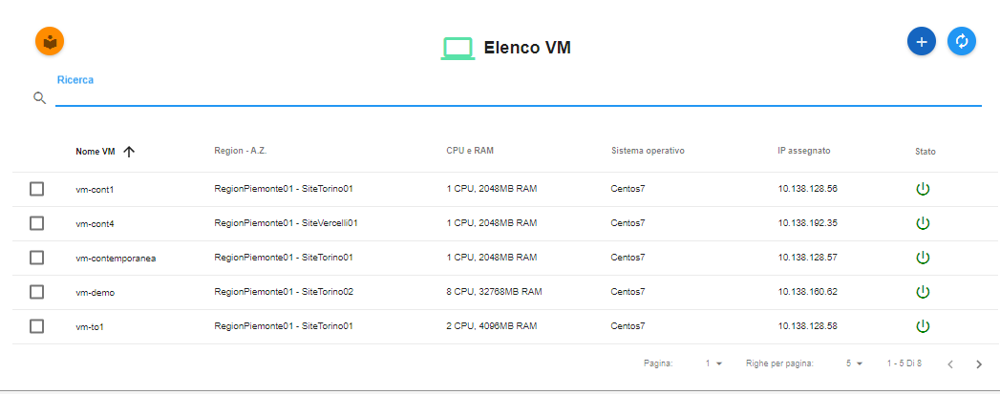
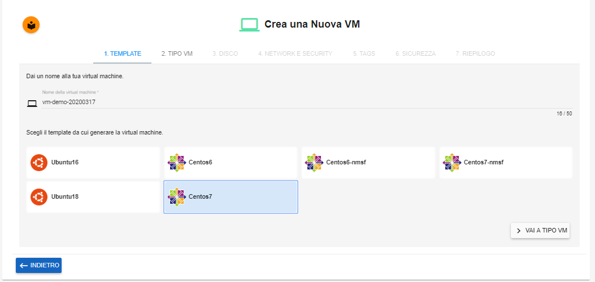
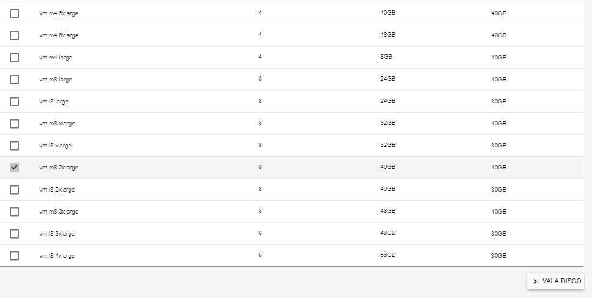
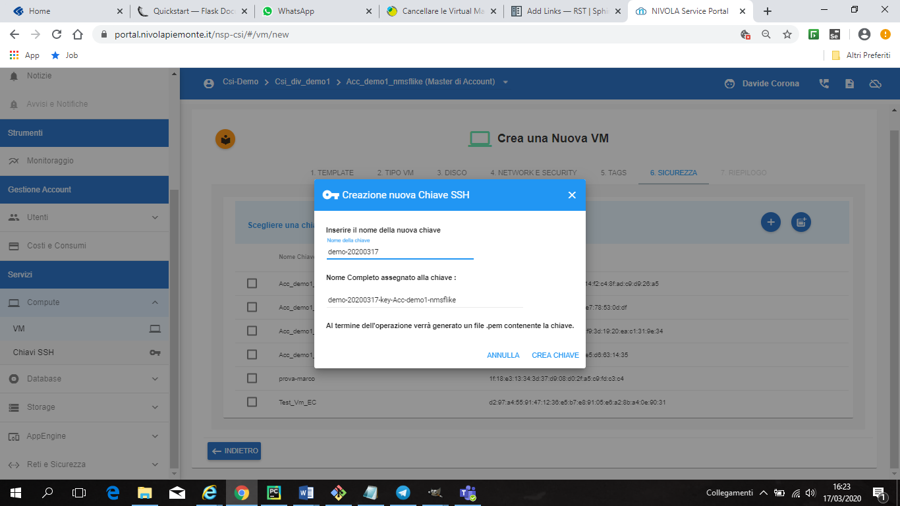

.. _Creare_VM:

**Creare Virtual Machine**
===========================
La funzione rientra nel **servizio compute**. La **creazione Vm** è attivabile dalla parte
sinistra dello schermo, cliccando sulla label **VM** sotto **Compute**

.. image:: img/VM_innesco_crea.png

A seguito di un clic su **VM**, il sistema popolerà la
parte destra del video con l'**Elenco delle VM**.

Per la creazione del server, dalla lista, procedere in questo modo:

1. Fare clic sul pulsante **"+"**:

.. image:: img/Add_VM.png

2. Inserire il **Nome della virtual machine** nella textbox e scegliere il **TEMPLATE**
   da cui generare la virtual machine. Per farlo baste un clic su uno degli OS proposti
   e in ultimo sul pulsante **VAI TIPO VM**;

3. Specificare il type, la CPU, la RAM e il Disco sfruttando il **CheckBox** in testa ad ogni riga esposta
dal portale e cliccare sul pulsante **VAI A DISCO**;

4. Indicare dimensione del disco ed eventualmente, aggiungere altri dischi,
sfruttando il pulsante **AGGIUNGI DISCO AGGIUNTIVO**. Al termine,
proseguire cliccando su **VAI A NETWORK E SECURITY**;

.. image:: img/Disco_VM.png

5. Sfruttando le combo box proposte, inserire: **Region, Availability Zone,
Subnet e Gruppo di sicurezza**.  Al termine cliccare su **VAI A TAGS**;

.. image:: img/Network_Security_VM.png

6. Nel caso servissero, è possibile assegnare dei tags alla virtual machine,
scrivendoli nella casella di testo e premendo invio.
E' possibile eliminare quanto inserito in precedenza, cliccando la **"X"**
a fianco dei tags da cancellare. Alla fine, proseguire premendo **VAI A SICUREZZA**;

.. image:: img/Tags_VM.png

7. In questa fase è obbligatorio generare una **CHIAVE SSH** da associare alla
virtual machine, per farlo, Nivola mette a disposizione 3 metodi distinti.

**SCEGLIENDO UNA DELLE CHIAVI DALLA LISTA**

Con questa soluzione il sistema propone una serie di **chiavi ssh** da cui scegliere.
L'operatore potrà individuare la chiave sfruttando la checkbox
e successivamente, concludere premendo **VAI A RIEPILOGO**;

.. image:: img/key-ssh-selezionata-da-lista.png

**CREANDO CHIAVE SSH EX NOVO**

Con questo metodo si chiede al sistema di generare direttamente una
nuova **chiave ssh**;

Il processo inizia premendo il tasto **"+"**

.. image:: img/Add_VM.png

Nella casella di testo, **Inserire nome della nuova chiave**
dando modo al sistema di generare la chiave
unenedo il nome dell'aacount al termine della stringa appena
digitata. Terminare premendo **CREA CHIAVE**

dopo di che distinguerla nella lista e premere **VAI A RIEPILOGO**;

.. image:: img/key-ssh-selezionata-da-lista.png

**IMPORTANDO LA CHIAVE SSH**

Premere il tasto per la "creazione"

.. image:: img/Crea-ssh-da-lista.png

**Inserire il nome chiave**, immettere la chiave precedentemente generata
nel campo di testo  **Inserire la chiave** e
premere **IMPORTA**;

.. image:: img/Importa-key-ssh.png

Conclusa la generazione della **chiave ssh**, utilizzare la checkbox per
selezionarla dalla lista e premere **VAI A RIEPILOGO**;

.. image:: img/key-ssh-selezionata-da-lista.png

8. Controllare gli attributi del server da creare
e validarli premendo sul pulsante **CONFERMA E CREA LA VIRTUAL MACHINE**.
Il portale procederà alla creazione della **VM** utilizzando i parametri
inseriti dall'operatore;

.. image:: img/Riepilogo_VM.png

9. Attendere qualche secondo e il server, comparirà nell’**ELENCO VM**.
Lo stato iniziale della nuova **Virtual Machine** sarà **acceso** e
quindi disponibile.

.. image:: img/VM-Lista-ready.png