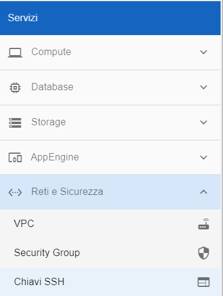
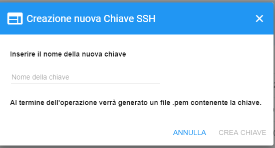
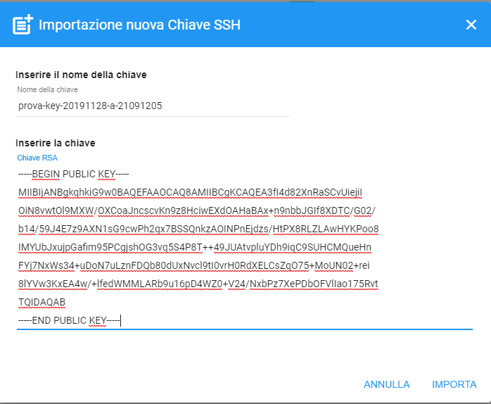
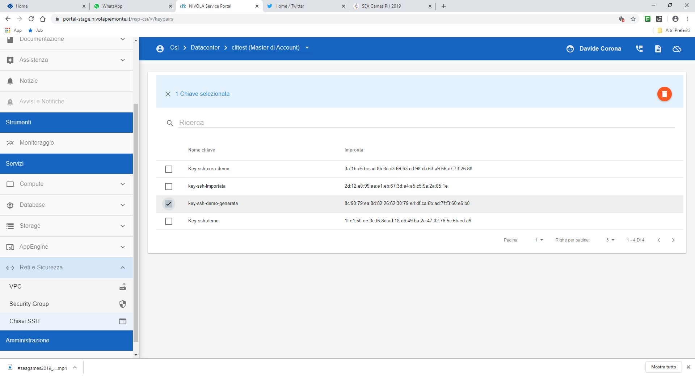

.. _Gestione_chiavi_ssh:

**Creare o Cancellare chiavi SSH**
**********************************
La funzione è utilizzabile da **Reti e Sicurezza** cliccando sulla voce **Chiavi SSH**

E' possibile creare **chiavi ssh** attraverso 2 metodi [1]_ [2]_
ma per entrambi è necessario rispettare questi vincoli:

- Il **nome della chiave ssh** deve essre **univoco** in tutto il sistema.

- Il **nome della chiave ssh** non può superare i 40 caratteri

- Nel **nome della chiave ssh** oltre le lettere e i numeri
  gli unici caratteri particolari ammessi sono **"_"** e **"-"**

.. image:: img/Add_VM.png

.. [1]
**Creazione direttamente da Nivola**
====================================

Premere tasto **"+"**;

.. image:: img/Add_VM.png

**Inserire nome della nuova chiave** e attendere la produzione. Una volta
 generata, selezionarla, premere **CREA CHIAVE** e attendere la risposta del sistema.

.. [2]
**Creazione attraverso l'import**
=================================

Premere il tasto **"+"**;

**Inserire il nome chiave**, digitare la chiave precedentemente
generata nella casella **Inserire la chiave**
premere **IMPORTA**.

**Cancellare Chiave SSH**
=========================

Selezionare la **chiave ssh** da cancellare e premere il tasto arancione con il simbolo del cestino.

Il sistema chiederà conferma dell'operazione:

.. image:: img/Keyssh-conferma-cancellazione.png

Confermare, cliccando su **"SI"** e la chiave verrà eliminata, scomparendo dall'elenco.
