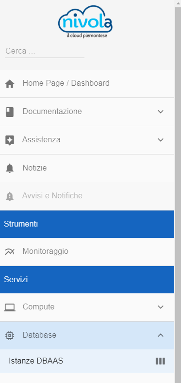
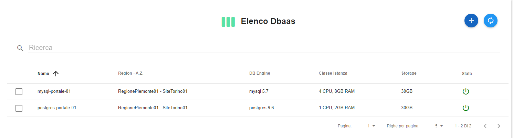
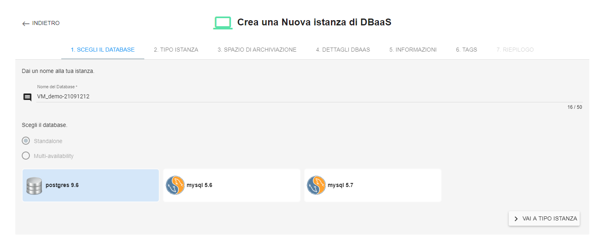
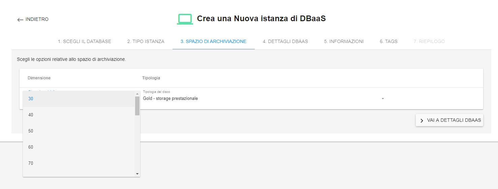
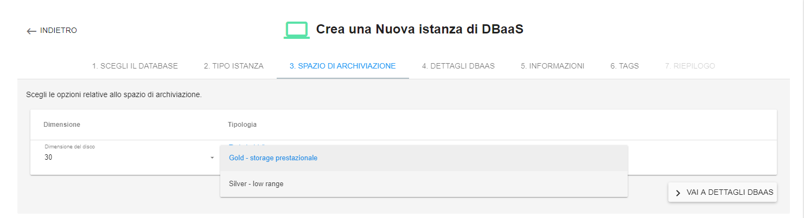
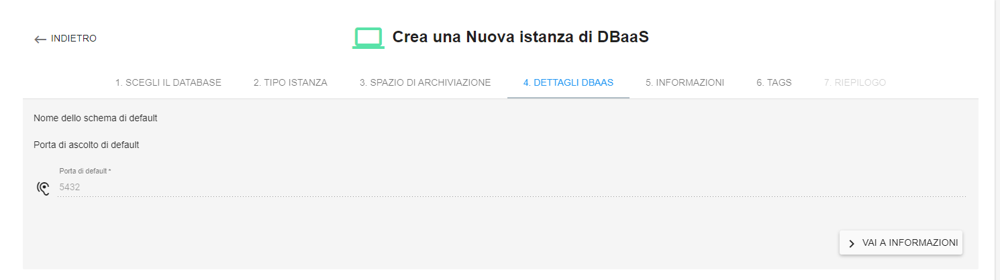
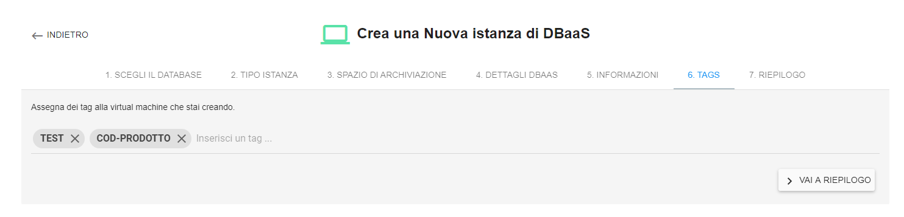
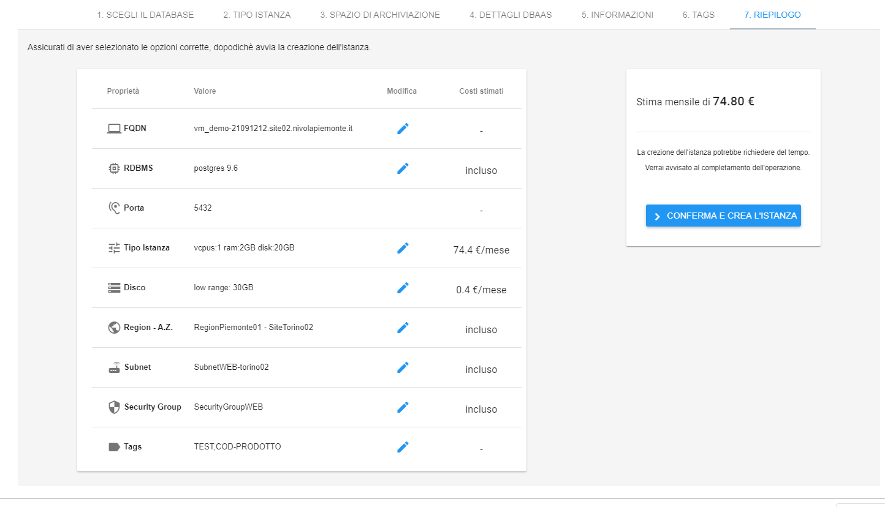

.. _Creare_DBAAS:

**Creare DBAAS**
*****************

La funzione rientra nel **database**. La **creazione DBAAS** è attivabile dalla parte
sinistra dello schermo, cliccando sulla label **Istanze DBAAS**
sotto **Database**

A seguito di un clic su **Istanze DBAAS** il sistema popolerà la
parte destra del video con l'**Elenco Dbaas**.

Per la creazione di un istanza DBAAS, procedere come segue:

1. Fare clic sul pulsante **"+""**:

.. image:: img/Add_VM.png

2. Inserire **Nome del database** nella casella di testo e indicare a Nivola l'engine
cliccando una delle opzioni proposte. Al termine premere **"VAI AL TIPO DI ISTANZA"**

3. Scegliere il la dimensione delle risorse da assegnagnare all'istanza di DBAAS
mettendo un flag nella *check box* utile e cliccare sul pulsante **VAI A SPAZIO DI ARCHIVIAZIONE**

.. image:: img/DBAAS_scegli_tipo_istanza.png

4.Nella sezione **SPAZIO DI ARCHIVIAZIONE** indicare la **dimensione**, sfruttando i valori presenti
nella **combo box**

5.Nella stessa sezione sfruttando la **combo box**,
indicare la **tipologia** dello spazio di archviazione
e premere **"VAI A DETTAGLI DBAAS"**

6. Indicare al sistema la **porta di ascolto** convalidando il valore di default
o inserendo un valore nella casella di testo e proseguire facendo un clic su **"VAI A INFORMAZIONI"**

6.Sfruttando le combo box inserire: **Region, Availability Zone,
Subnet e Gruppo di sicurezza**.  Al termine cliccare su **VAI A TAGS**.

7. Qualora servisse, assegnare dei tag all'istanza,
scrivendo la stringa premendo invio.
E' possibile cancellare quanto inserito in precedenza utilizzando la **"X"**
a fianco dei tags. Alla fine, premere **VAI A RIEPILOGO**.

.8 Nel **riepilogo** dopo aver controllato i parametri inseriti nel processo di creazionoe
premere **"CONFERMA E CREA L'ISTANZA"** per dar vita alla nuova entità
del sistema.

