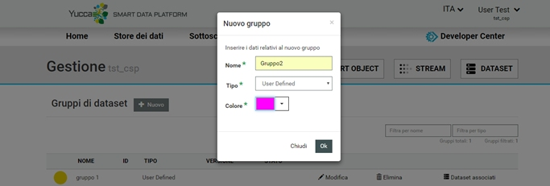

.. _gruppi_dataset:

**Gestire gruppi di dataset**
******************************

Si potranno associare uno o più dataset con caratteristiche comuni ad uno stesso gruppo.
Ciascun gruppo è caratterizzato da un nome, una tipologia, un colore, uno stato ed una versione.

Cliccando su GESTISCI GRUPPI nella sezione DATASET verrà visualizzato l’elenco dei gruppi già esistenti.

.. image:: img/Gruppi_Dataset1.jpg

Si potrà creare un nuovo gruppo oppure, per ogni gruppo già disponibile, effettuarne la modifica , l’eliminazione o gestirne l’associazione ai dataset.

.. image:: img/Gruppi_Dataset2.jpg

Nuovo Gruppo
============

Cliccando su NUOVO si aprirà una finestra in cui inserire nome, tipo e colore del nuovo gruppo e sarà possibile procedere con la creazione del gruppo stesso.

Modifica di un gruppo già esistente
===================================

Cliccando sul bottone Modifica relativo al gruppo che si intende variare, verrà visualizzata una finestra in cui inserire il nuovo nome/colore.
Il campo Tipo non sarà modificabile.

.. image:: img/Gruppi_Dataset4.jpg

Dataset associati
=================

Cliccando su Dataset Associati si aprirà una finestra contenente l’elenco di tutti i dataset associati al gruppo.

Da qui sarà possibile:

-  rimuovere i dataset dal gruppo 
- cliccando su Visualizza in gestione la lista dei dataset (in basso a sinistra) , si verrà reindirizzati alla pagina di Gestione dei dataset filtrata con l’elenco dei soli dataset associati.

.. image:: img/Gruppi_Dataset5.jpg

Associazione dataset – gruppi
=============================

Dalla pagina di gestione dataset, selezionando uno o più dataset, verrà abilitato il bottone Aggiungi a gruppo.

.. image:: img/Gruppi_Dataset6.jpg

Cliccando sui Aggiungi a gruppo verrà visualizzata una finestra con l’elenco dei gruppi esistenti.

Selezionando uno o più gruppi e cliccando su OK verrà realizzata l’associazione

.. image:: img/Gruppi_Dataset7.jpg

Cliccando invece sul bottone CREA NUOVO GRUPPO si aprirà la finestra di creazione di un nuovo gruppo con i relativi campi da compilare e cliccando su OK verrà realizzata l’associazione.

.. image:: img/Gruppi_Dataset8.jpg

