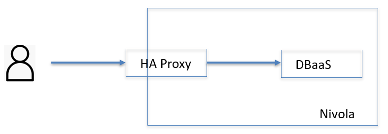

.. _Accedere_DBAAS:

**Come accedere al Database as a Service**
***************************************

L’accesso alle base dati può essere oltre che applicativo anche a livello utente. Quest’ultimo accesso può avvenire
da rete VPN o dalla propria postazione di lavoro, esso però, non è diretto. Infatti, l’accesso avviene tramite un haproxy,
questa url viene fornita dal gruppo di supporto, quando si informano i richiedenti del provisioning.
Per collegarsi al DB, ogni fruitore può utilizzare uno strumento a proprio piacere.

