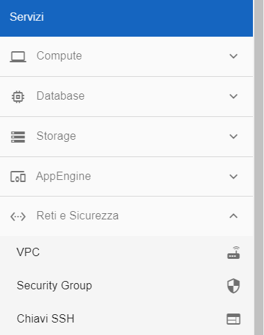
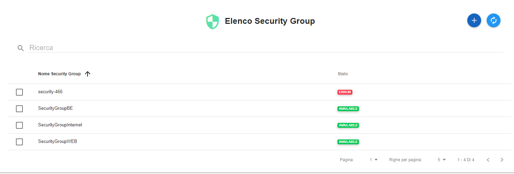
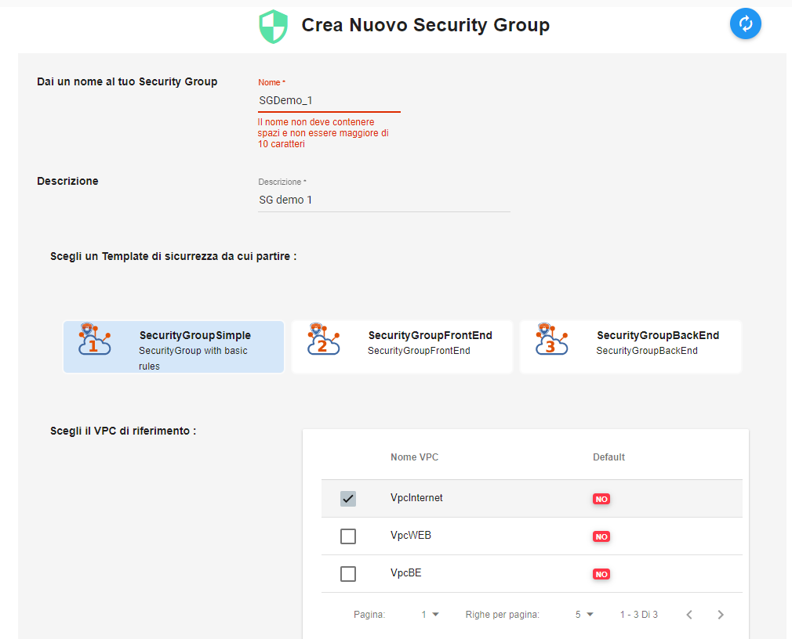

.. _Creare_Security_Group:

**Creare un Security Group**
****************************

La funzione rientra in **Reti e Sicurezza**. La **creazione SG**
è utilizzabile dalla parte sinistra dello schermo,
cliccando la freccia a fianco di **Reti e Sicurezza**
e successivamente su **Security Group** nel sottomenù.

A seguito di un clic su **Security Group**, il sistema,
esporrà l'**Elenco dei Security Group** nella parte centrale
dello schermo.

Per istanziare un Security Group, procedere seguendo i passaggi successivi:

1. Fare clic sul pulsante **"+""**:

.. image:: img/Add_VM.png

2. Specificare i parametri necessari al sistema:

•	Inserire **Nome del Security Group** nella textbox, rispettando la regola che non deve contenere spazi e non superare i 10 caratteri;
•	Scrivere la **Descrizione** nella casella di testo;
•	Optare per un **Template di sicurezza** selezionandolo tra quelli proposti;
•	Indicare il **VPC di riferimento** evidenziandolo dalla checkbox;

3. Terminare premendo su **CREA SECURITY GROUP**,

