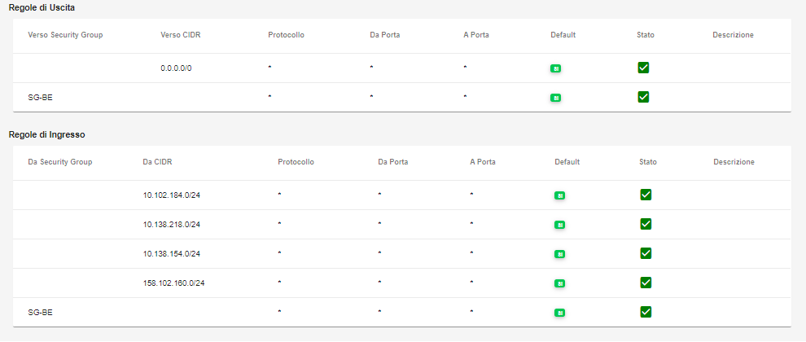
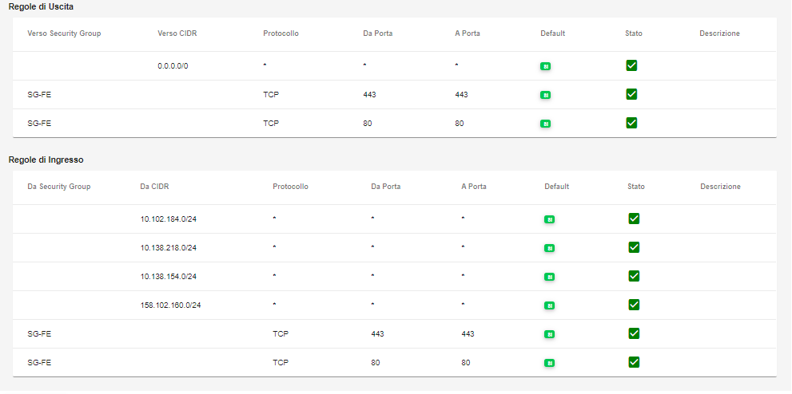
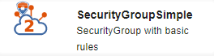
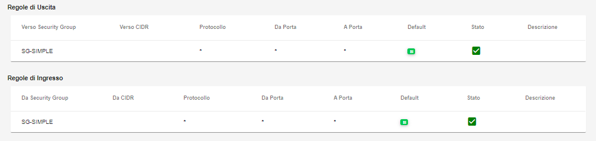
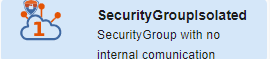
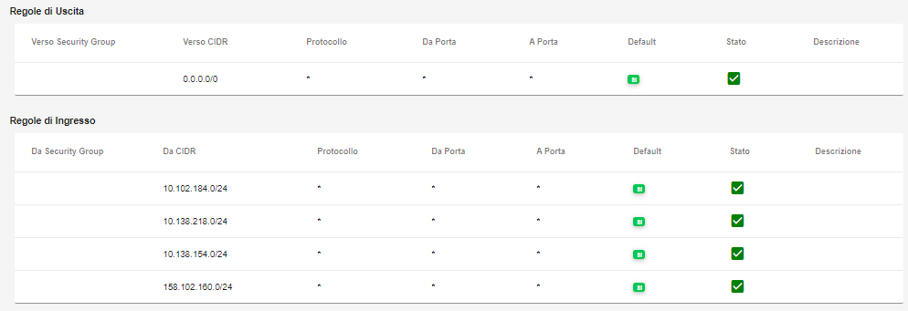
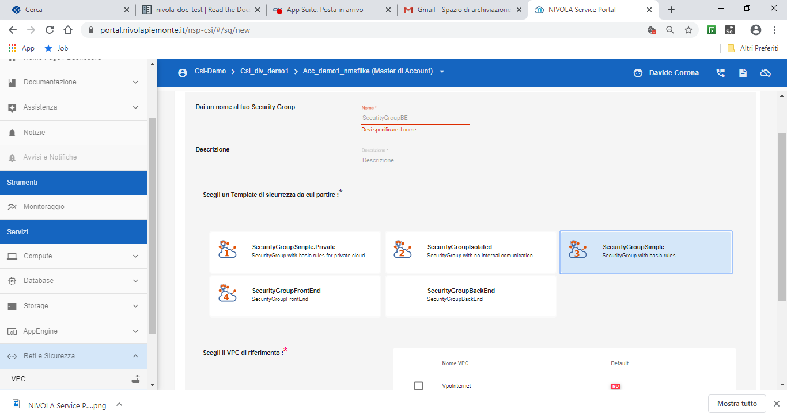
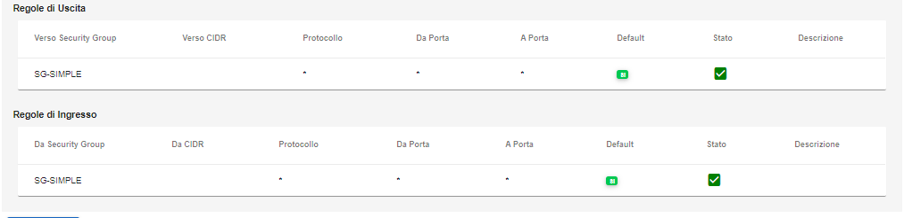

.. _Template_Sicurezza:

**Template di Sicurezza**
*************************

I template di Sicurezza sono utilizzati
nella fase di :ref:`creazione del Security Group <Creare_Security_Group>`.

Ogni template ha delle policies definite di default, che permettono la comunicazione
tra server posti all'interno e all'esterno dello stesso SG.

Per acquisire familiarità con la tematica dei template è importante
conoscere i **CIDR** (subnet, indirizzi IP) su cui si attestano
gli host delle reti di Management e quelli di Gestione.

Per **rete di gestione** sono da interdersi tutte le reti su cui
sono collocate le postazioni degli amministratori di sistema.
Sulla **rete di management** invece, è
dove sono connessi tutti gli host e/o server
infrastrutturali, dedicati ai servizi.

La tabella riportata è lo schema a cui l'utente può fare riferimento.

+------------------------+-----------------------------------------+
|          CIDR          |             DESCRIZIONE                 |
+========================+=========================================+
| 158.102.160.0/24       | **Classe di indirizzi IP** degli host   |
|                        | attestati sulla rete di **Gestione**    |
+------------------------+-----------------------------------------+
| 10.102.184.0/24        | **Classe di indirizzi IP** degli host   |
|                        | attestati sulla rete di **Gestione**    |
+------------------------+-----------------------------------------+
| 10.138.154.0/24        | **Classe di indirizzi IP** degli host   |
|                        | attestati sulla rete di **Management**  |
+------------------------+-----------------------------------------+
| 10.138.218.0/24        | **Classe di indirizzi IP** degli host   |
|                        | attestati sulla rete di **Management**  |
+------------------------+-----------------------------------------+

I modelli utilizzabili, in alternativa tra loro, sono:

    1. :ref:`Security Group BackEnd`
    2. :ref:`Security Group FrontEnd`
    3. :ref:`Security Group Simple`
    4. :ref:`Security Group Isolated`
    5. :ref:`Security Group Simple Private`

.. _Security Group BackEnd:

**Security Group BackEnd**
==========================

I servizi che assumono questo modello consentono di uscire
dal Security Group senza alcuna limitazione in quanto a IP e alle Porte.

Per gli Host collocati al suo interno, la comunicazione
potrà avvenire senza filtri in grado di inibire porte ed IP.

Le uniche macchine in grado di accedere saranno soltanto quelle
poste sulle reti di Management e di Gestione.

.. _Security Group FrontEnd:

**Security Group FrontEnd**
===========================

.. image:: img/Template-frontend.png

I Security Group che usano questo template permettono di uscire
senza alcun vincolo di Ip e di porte.

Dentro il perimetro del SG, le VM possono comunicare
soltanto attraverso le **porte 80 e 443**.

Gli host che di default sono in grado raggiungere il SG, creato con questo template,
sono quelli attestati sulla rete Management e su quella di Gestione.

.. _Security Group Simple:

**Security Group Simple**
=========================

E' un modello che impedisce ogni tipo di comunicazione da e
verso l'esterno del Security Group che lo adotta.
La trasmissione e la comunicazione è  consentita
unicamente tra gli host dello stesso SG.

.. _Security Group Isolated:

**Security Group Isolated**
===========================

Questo template caratterizza il SG che lo utilizza ad impedire
agli host al suo interno di comunicare tra loro
mentre l'uscita è priva di filtri.
L'ingresso è consentito esclusivamente ai server delle reti di Management e di Gestione.

.. _Security Group Simple Private:

**Security Group Simple Private**
=================================

Isola completamente il Security group che nasce assumendolo come
template, quindi nessuno degli host è raggiungibile
sia per ricevere e per comunicare.
La comunicazione, tra gli host all'interno dello stesso SG, è
priva di ogni restrizione in entrata ed in uscita.

