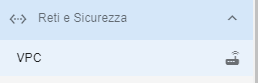
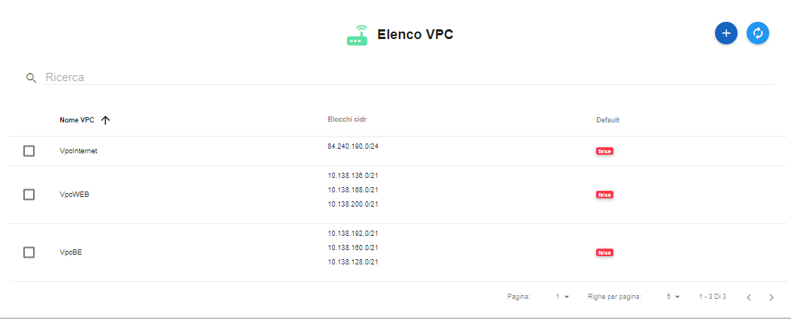
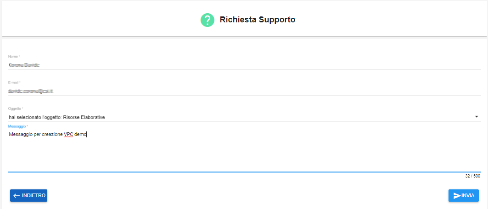

.. _Creare_VPC:

**Creare un VPC**
*****************

La funzione rientra in **Reti e Sicurezza**. La **creazione SG**
è utilizzabile dalla parte sinistra dello schermo,
cliccando la freccia a fianco di **Reti e Sicurezza**
e successivamente su **VPC** nel sottomenù.

A seguito del clic su **VPC**, il sistema,
esporrà l'**Elenco VPC** nella parte centrale
dello schermo.

La creazione di un VPC avviene
con una richiesta specifica al **Supporto del Csi-Piemonte**.
Il provider, dopo aver preso in carico la richiesta, avviserà l'utente
non appena conclusa l'attività prevista.
L'istanza è effettuata via e-mail dal sistema dopo la compilazione di una form
come spiegato nei passaggi successivamente descritti.

1. Fare clic sul pulsante **"+"**:

2. Specificare i parametri necessari al sistema:

•	Inserire **Nome** ed **e-mail** del richiedente;
•	Indicare l'**Oggetto** selezionandolo tra quelli proposti nella combo;
•	E' possibile accompagnare la richiesta, scrivendo un **Messaggio** nella textbox;

3. Terminare la richiesta, premendo il tasto **INVIA**;

