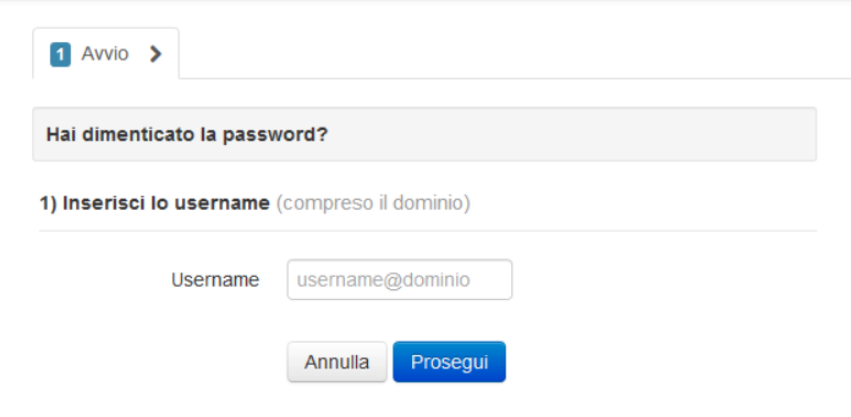

.. _Gestione_password_esterni:

**Gestione Password Fornitori Esterni**
***************************************

Operazione specifica per i fornitori esterni che non sono organici all’organizzazione csi e che accedono ad un utenza
nome.cognome@fornitori.nivola e che hanno la necessità di cambiare o creare la password.

Collegarsi alla url https://sa.csi.it/nivola
Nella pagina evidenziata, al punto 1, si trovano le indicazioni per gestire il cambio password e la creazione
della prima password. Nello specifico si deve accedere alla url https://comunica.csi.it/cambia-password/index.html

In questa pagina si inserisce la user nome.cognome@fornitori.nivola e si segue la procedura che prevede una telefonata gratuita con il cellulare indicato in fase di attivazione.

