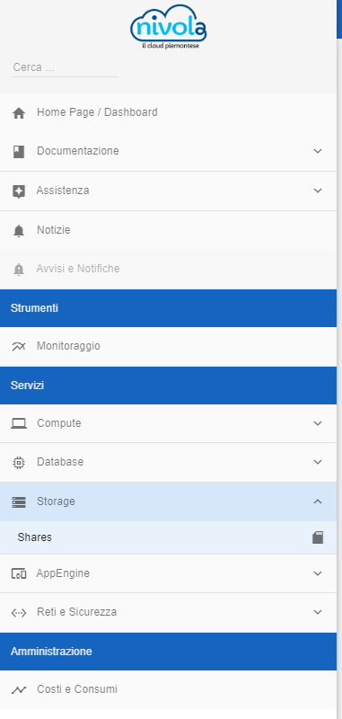
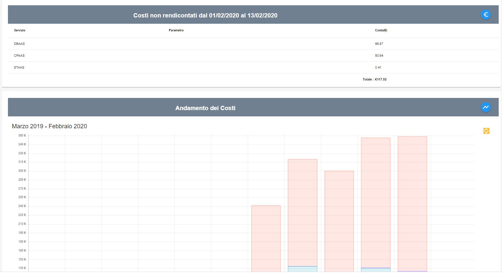

.. _Consultare_costi_e_consumi:

**Consultare costi e consumi**
******************************

I **Costi e Consumi** sono visibili attraverso il menu posto alla
sinistra dello schermo. Cliccando sulla label **Costi Consumi**
sotto la label **Amministrazione**

A seguito del clic su **Costi e Consumi**, il sistema presenterà nella
parte destra del video i **Costi non rendicontati**
e l'**Andamento dei Costi**.
Il grafico la tabella esposti, fanno riferimento al **Consumo** e al **Costo**
dei servizi acquistati e istanziati nell'account.

