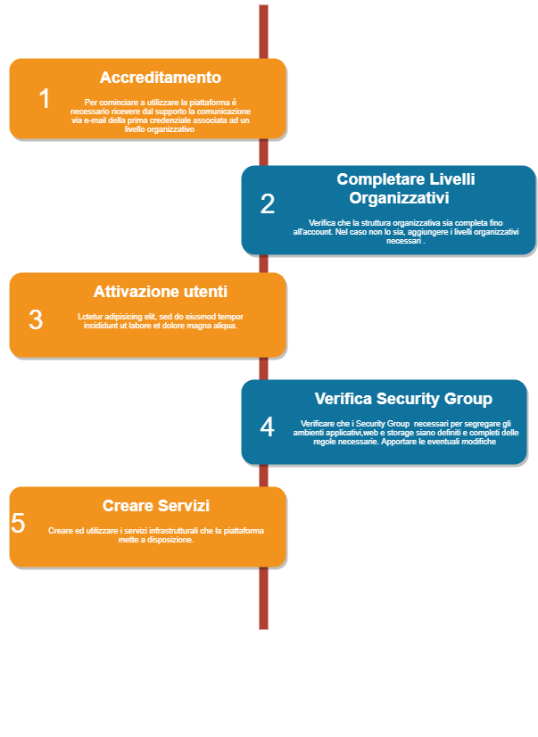

.. _Passaggi_necessari:

**Necessary steps**
===================

In order to start using the Nivola platform, you need to follow the steps below.

    1. :ref:`Processo di Accredito`
    2. :ref:`Completare i Livelli Organizzativi`
    3. :ref:`Attivare Utenti`
    4. :ref:`Verificare i VPC`
    5. :ref:`Verificare Security Group`
    6. :ref:`Creare i Servizi`

.. _Processo di Accredito:

**Accreditation Process**
=========================

In order to use the services exposed by the Nivola platform, it is necessary to be accredited according to the following process:

1.	Contact your reference account or go to the Contacts section accessible from the site www.nivolapiemonte.it. Once the contract or the use of the service in "Demo" mode has been activated, the Nivola Support Team will contact the customer's reference account to proceed with the creation of the first access credentials.
2.	After receiving the official registered offer, proceed with issuing an order to CSI-Piemonte.
3.	Approve and commit the amount in the offer by means of a decision.
4.	Please send the documentation by PEC to protocollo@cert.csi.it, indicating in the subject line of the email:
    a)	Activation of Nivola Services.
    b)	Protocol number on the offer.
    c)	Name of organisation.
5.	Please indicate a contact person who will be contacted by our support service for technical details. If the person to be contacted in the event of a security incident is different from the person indicated above, a different contact person must be identified in accordance with the latest data breach regulations.

These aspects are set out in the service user manual and in the general terms and conditions, where you can find more details and information, including on the termination of the service. Should this occur the ISC undertakes to make its data available to the Customer and subsequently to delete them.

.. image:: img/Richiesta_accredito.png

At the end of the application phase you will receive an e-mail from the Support Team informing you of your **first accreditation**. In this way the user will be able to check the organisational structure modelled by Support and grant further accreditations.

.. _Completare i Livelli Organizzativi:

**Completing the Organisational Levels**
========================================

The platform consists of three organisational levels, the one hosting the services being the **account**. If the account has not been defined by the support, before creating it it will be necessary to identify or create a **Division** on which it depends. The presence of the **Organisation** and the Division are necessary conditions for the generation of the **account**.

.. _Attivare Utenti:

**Activate Users**
==================

After having set up the organisational structure, it will be possible to indicate to **Nivola** the **users** associated with **roles** which, at each level, will be able to act on the objects with specific tasks.

.. _Verificare i VPC:

**Check VPCs**
==============
After creating the account and associating the users with the correct organisational profile, the correct configuration of their **VPCs (Virtual Private Cludes)** must be checked. Within their VPCs, users can manage and configure their own resources. The **VPC** guarantees the necessary isolation between the various organisations.

.. _Verificare Security Group:

**Check Security Group**
========================

Nivola provides some pre-configured SGs, but it is possible to modify their rules or create new SGs according to specific needs. "It is therefore important to check them and eventually modify or integrate them before starting to create the Services. In any case, it will always be possible to modify the security rules even after the Services have been created, but it is not possible to move a Service from one SG to another after it has been created. In this case it will be necessary to destroy the Service and recreate it in the correct SG.

.. _Creare i Servizi:

**Creating Services**
====================
After completing the above steps, you can start creating services via the Service Portal menu. The creation process is always guided through a creation wizard. The process can always be interrupted before the final confirmation and you can directly access this guide for more information.

