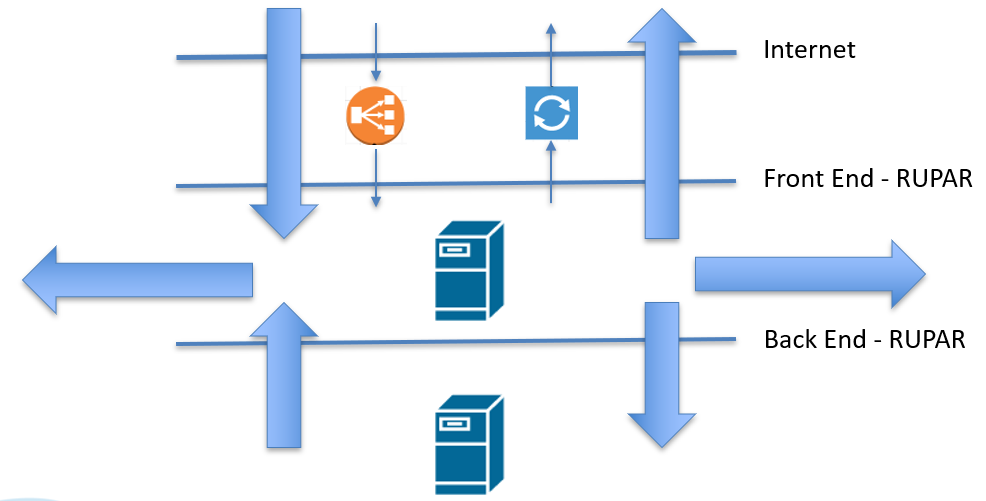
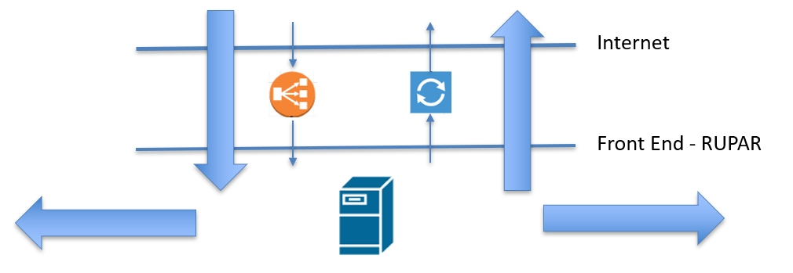
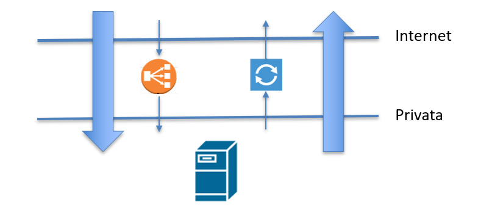
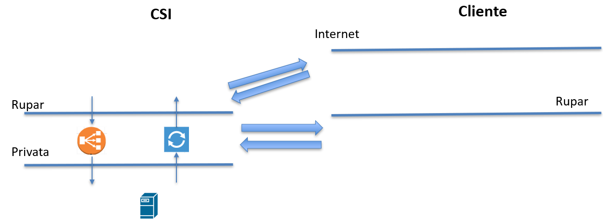

.. _Modelli_di_rete:

**Modelli di Rete**
*******************

In tutti i modelli la rete internet non può ospitare dei server, la comunicazione avviene come descritto nella sezione
“Come comunicare con Internet”.

RUPAR Cloud CSI.
================

Questo tipo di modello di rete è stato pensato per ospitare gli asset del CSI,
utilizzati per erogare servizi per i propri clienti. L’immagine sottostante descrive le possibili comunicazioni di rete:

Sono presenti tre reti:

-	**Internet**, si riferisce ad un piano di indirizzamento pubblico;
-	**Front-end (RUPAR)**, si riferisce ad indirizzi della rete RUPAR per condividere ed accedere a sistemi e servizi con altri Enti della PA; questi sistemi possono essere raggiunti dalla rete internet tramite NAT e Bilanciatore;
-	**Back-end (RUPAR)**, si riferisce ad indirizzi IP privati non raggiungibili tramite internet e  che consentono la comunicazione solo con sistemi e servizi sulla stessa sotto ret o con la front-end corrispondente.

RUPAR Cloud ENTI.
=================
Questo tipo di modello è stato ideato per ospitare
i servizi degli Enti che intendono avvalersi del cloud del CSI.
L’immagine sottostate descrive le possibili comunicazioni di rete:

Sono presenti due reti:

-	Internet, si riferisce ad un piano di indirizzamento pubblico;
-	Front-end (RUPAR), si riferisce ad indirizzi della rete RUPAR per condividere ed accedere a sistemi e servizi con altri Enti della PA o del CSI; questi sistemi possono essere raggiunti dalla rete internet tramite NAT e Bilanciatore

Private Cluod – Internet.
=========================

Questo tipo di modello è idoneo per gli Enti non
in RUPAR o per le aziende che intendono utilizzare il CSI come proprio Cloud Provider.

Sono presenti due reti:
-	Internet, si riferisce ad un piano di indirizzamento pubblico;
-	Privata, si riferisce ad indirizzi privati (non RUPAR)  con i quali è possibile comunicare solo all’interno di questa sottorete o con Internet.

Private Cloud – RUPAR.
======================
Questo tipo di modello è funzionale per gli Enti che sono in RUPAR, che hanno
un proprio accesso verso Internet e che vogliono usarlo per i propri servizi
ospitati sul Cloud del CSI.

L’immagine sottostante descrive questo scenario:

-	RUPAR, si riferisce ad un piano di indirizzamento RUPAR dell’Ente;
-	Privata, si riferisce ad indirizzi privati (non RUPAR)  con i quali è possibile comunicare solo all’interno di questa sottorete o con la rete RUPAR dell’Ente.

