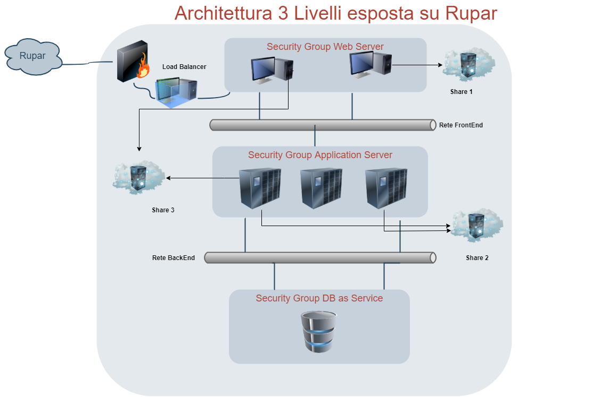

.. _Modello_architetturale_3_livelli_no_internet:

**Modello architetturale 3 livelli su rete privata (RUPAR)**
************************************************************

La scelta dei 3 livelli rispetta la logica che i Web Server
siano gli unici raggiungibili da Rete privata (Rupar)
e dotati delle opportune protezioni.
Gli Application Server, invece, sono da porre nella rete di Backend perchè
devono essere connessi esclusivamente
dai Web Server. Le istanze di Data Base as a Service (DBaaS)
sono da collocare nella rete di backend, isolate e
utilizzabili solo dagli Application Server.

Il modello riportato nella figura sottostante, rappresenta un esempio
di infrastruttura applicativa, disposta su 3 livelli e
visibile da Rupar. Lo schema rappresenta
il paradigma consigliabile a fronte di risorse da proteggere e
in grado colloquiare attraverso reti diverse.
Il disegno riporta, istanze create all'interno di **tre security group** distinti
e attestati sulla rete di backend e su quella di frontend.
Il Security Group dedicato ai **Web Server**, permette,
alle VM create al suo interno, di essere raggiunte
da  **internet** sfruttando un
**Load Balancer** che è protetto da un **firewall**.
La **rete di backend** è condivisa dal Security group del **DB as a Service**
e da quello degli **Application Server**. In questo modo, l'istanza DBaaS, è
completamente separata e accessibile unicamente dalla rete di backend.
A cavallo delle reti invece, possono essere generate istanze dello
**Storage as Service**. Nello schema, sono stati collocati,  share
condivisi da macchine create su SG diversi o che rientrano nello stesso.

