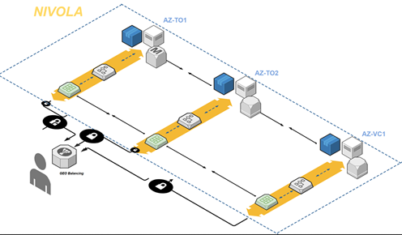
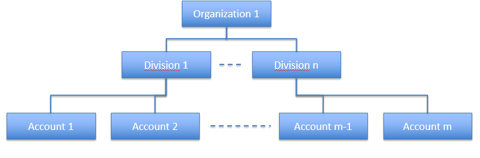
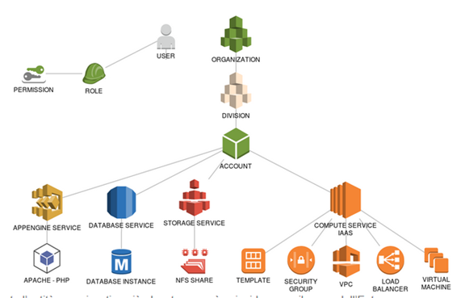

.. _Concetti_Base:

**I concetti base**
********************

**Le availability zones**
=========================

Sono le aree geografiche in cui risiedono i data center dei fornitori di servizi di cloud pubblico. Le aziende clienti
scelgono una o più zone di disponibilità per i loro servizi a seconda delle esigenze aziendali. Le Availability Zones
sono zone di disponibilità costituite da infrastrutture indipendenti, isolate e ospitate all'interno dei data center
del CSI Piemonte. In fase di creazione dei propri servizi è possibile scegliere l'Availability zone
in base a specifiche esigenze di distribuzione geografica mantenendo inalterata l'alta affidabilità.

.. _struttura_Organizzativa:

**La struttura organizzativa**
==============================

All'interno di Nivola sarà possibile modellare una struttura organizzativa su tre livelli
in modo da permettere di attritbuire responsabilità e gestione dei servizi
secondo una gerarchia precisa. Nell'**Account** sarà istanziata l'infrastruttura
in modo da soddisfare il fabbisogno tecnologico e di sicurezza necessario. Alla **Divisione**
è demandato il compito di controllo del consumo delle risorse degli Account che potrà creare
in assoluta  autonomia. Il vertice della struttura è costituito dall'**Organizzazione**
che avrà la visione completa dell'utilizzo della piattaforma con la possibilità di declinarla
in base alle Divisioni e agli Account.

La struttura organizzativa è la suddivisione gerarchica che permette di
personalizzare i servizi, l'accesso o le impostazioni per diversi gruppi
di utenti o dispositivi. Nella piattaforma Nivola la struttura
organizzativa si articola su 3 livelli:

-  **Organizzazione**: è gerarchicamente l’entità organizzativa più
   elevata e può coincidere con il nome del cliente ad esempio “Regione
   Piemonte”, “Csi Piemonte” e così via. Nella piattaforma le risorse
   sono a disposizione di varie organizzazioni, che sono però dal punto
   di vista logico completamente separate e indipendenti;

-  **Divisione**: è il secondo livello organizzativo. Una organizzazione
   può avere più divisioni. Il concetto di Divisione rappresenta quindi
   una suddivisione logica dell’Organizzazione, e può riflettere dunque
   una divisione di tipo territoriale, organizzativa o di tipo di
   business; inoltre ciascuna Divisione controlla le risorse e i consumi
   di ciascun Account all'interno della Divisione";

-  **Account**: è l’ultimo livello organizzativo e dipende dalla
   Divisione. Una Divisione contiene uno o più Account. L'Account è il livello
   organizzativo all'interno del quale l'Utente potrà creare, controllare e
   gestire i propri servizi. E' possibile creare molteplici Account con
   lo scopo di separare progetti differenti, oppure distinguere ambienti
   di sviluppo da quelli
   di produzione oppure allo scopo di suddividere la rendicontazione dei consumi.

Si noti che tutte le risorse e i servizi sono associabili solo a livello
di Account. Non è possibile associare i servizi alle Divisioni o alle
Organizzazioni. L’Account rappresenta quindi il contenitore in cui
vengono implementati e resi disponibili tutti i servizi utente. La
gestione delle risorse utente avverrà quindi a livello di Account con
dei ruoli abilitati ad operare a questo livello.

.. _utenti-ruoli:

**Utenti, ruoli ed Account**
============================

Si possono distinguere più ruoli all’interno della piattaforma, che si
correlano alla struttura organizzativa definita. Ad ogni ruolo può
corrispondere almeno un utente, e quindi almeno una persona fisica che
svolge quella funzione. Una persona registrata sul sistema può essere
associata a più ruoli anche su strutture organizzative differenti. Ad
esempio un utente può avere ruoli differenti su account anche di
divisioni distinte.

Ad oggi all’interno del sistema sono implementati i seguenti ruoli
utente.

**Master di Organizzazione**: questo ruolo rappresenta gli utenti che
possono svolgere funzioni amministrative all’interno dell’Organizzazione
quali la creazione, sempre all’interno dell’organizzazione di
pertinenza, delle divisioni e degli account; può inoltre profilare gli
utenti per renderli operativi all’interno della propria struttura ed
eventualmente registrare utenti non ancora presenti sulla piattaforma.
Il Master di Organizzazione può monitorare i costi e lo stato delle
risorse a tutti i livelli della propria struttura organizzativa
(divisioni e account) e visualizzarne i relativi report. Non ha però
accesso alle funzioni di gestione (creazione/modifica/cancellazione)
delle risorse associate agli account della propria organizzazione.

**Master di Divisione**: questo ruolo rappresenta gli utenti che possono
svolgere funzioni amministrative all’interno della Divisione quali la
creazione, sempre all’interno della divisione di pertinenza, degli
account; può inoltre profilare gli utenti per renderli operativi
all’interno della propria struttura ed eventualmente ha la possibilità
di registrare utenti non ancora presenti sulla piattaforma. Il Master di
Organizzazione può monitorare i costi e lo stato delle risorse a tutti i
livelli della propria struttura organizzativa (account) e visualizzarne
i relativi report. Non ha però accesso alle funzioni di gestione
(creazione/modifica/cancellazione) delle risorse associate agli account
della propria divisione.

**Amministratore di Back Office**: utente che all’interno del sistema ha
privilegi sulle funzioni di BackOffice (registrazione nuovi Utenti,
Accreditamento, creazione livelli organizzativi) e monitoraggio costi e
stato della piattaforma. L’Amministratore di BackOffice può profilare
utenti con ruoli a qualsiasi livello della struttura organizzativa. Può
inoltre accedere ai report dei costi e consumi aggregati a qualsiasi
livello. Il ruolo è solitamente associato a utenti dei gruppi di
gestione e supporto Csi Piemonte.

**Master di Account**: utente che all’interno dell’Account può gestire
tutte le risorse, sulle quali ha quindi il massimo dei privilegi. Il
Master di Account può quindi creare/cancellare/modificare le risorse,
può anche gestire le risorse create da altri utenti nell’account. Il
Master di Account può visualizzare e accedere ai report dei costi e dei
consumi relativamente al proprio account. Il master di account non può
registrare nuovi utenti all’interno del proprio account e non può
profilare utenti già censiti ad accedervi.

**Viewer di Account**: utente che all’interno dell’Account può visualizzare
tutte le risorse, sulle quali non ha però privilegi di modifica/cancellazione.
Il Viewer di Account può quindi visualizzare l'elenco dei servizi attivi
sull'Account , può visualizzarne il dettaglio, ma non ha possibilità 
di attivarne di nuovi e modificarne lo stato. 
Il Viewer di Account può visualizzare e accedere ai report 
dei costi e dei consumi aggregati dell'account. Il Viewer di account non può
registrare nuovi utenti all’interno della piattaforma e non può
profilare altri utenti ad accedervi.

La fase di introduzione di un nuovo utente si articola in questo modo:
un master, nel limite dei privilegi del suo livello gerarchico, può
accreditare un utente registrato sulla piattaforma assegnandogli un
ruolo, in questo modo gli concede dei permessi per svolgere determinate
funzioni che faranno ricadere il nuovo utente in un determinato gruppo.

La stessa operazione può essere effettuata e delegata all’operatore di
Backoffice.

Riassumendo:

-  Un Master di Organizzazione può accreditare o revocare utenti
   all’interno delle proprie divisioni o account

-  Un Master di Divisione può accreditare o revocare utenti all’interno
   dei propri account.

-  L’Amministratore di Backoffice può accreditare o revocare ruoli agli
   utenti a qualsiasi livello della struttura gerarchica.

