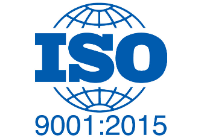
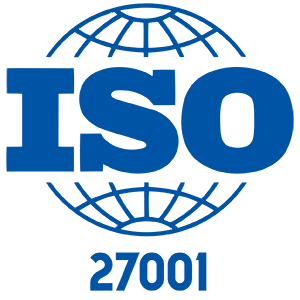
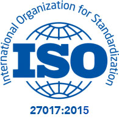
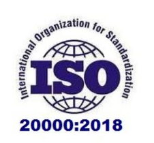
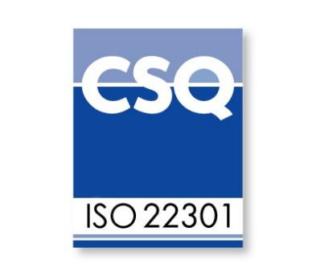
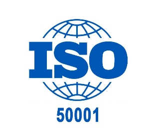
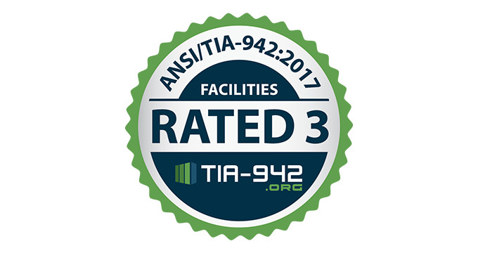
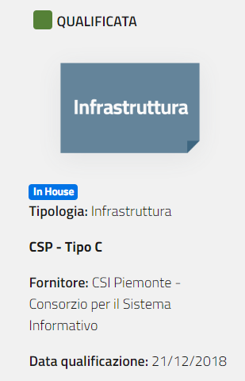
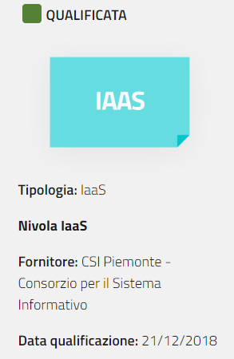
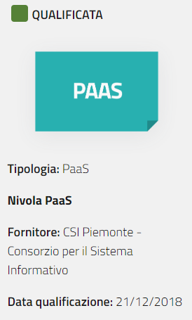

.. _Certificazioni_Compliance:

**Certificazioni e Compliance**
*******************************

Per noi Sicurezza e Privacy sono fondamentali e così importanti
che lo sviluppo della piattaforma Nivola è stato
condotto tenendo in considerazione tre aspetti determinanti:

- **sicurezza informatica**
- **organizzazione del servizio**
- **affidabilità**.

Partendo da questi pilastri sono stati individuati servizi, processi,
organizzazione e soluzioni informatiche che rispondessero appieno
alle normative italiane ed internazionali in particolare per i
servizi di cloud computing e per i data center che ospitano le
Availability Zones Nivola inclusa la connettività attestata presso i
data center di Torino e Vercelli. Applicando questi vincoli abbiamo
ottenuto le più importanti certificazioni in ambito Cloud che ci
rendono conformi ai maggiori standard di sicurezza e affidabilità.

**ISO 9001:2015**

La Certificazione assicura che il nostro sistema prevede la gestione
sistematica dei rischi e delle opportunità, il monitoraggio costante
dei processi aziendali per garantire standard di qualità,
e il rispetto di tempi e costi del servizio nell’ambito di:

-  progettazione, realizzazione, interconnessione, manutenzione,
   addestramento, gestione e conduzione operativa di **sistemi
   informativi automatizzati e di servizi informatici
   applicativi, infrastrutturali e di rete;**

-  progettazione e erogazione di **interventi formativi** e formazione
   sui servizi ICT erogati.

**ISO 27001:2013**

Lo standard **ISO/IEC 27001** è l'unica norma internazionale soggetta a
verifica e certificabile che definisce i **requisiti per un SGSI**
(Sistema di Gestione della Sicurezza delle Informazioni) ed è
progettata per garantire la selezione di controlli di sicurezza
adeguati e proporzionati.
Si basa su precisi requisiti atti a garantire la sicurezza nella
gestione delle informazioni e nel trattamento dei rischi derivati.
La certificazione ottenuta dal CSI Piemonte garantisce che tutti i
servizi cloud a disposizione dei Clienti sono progettati per garantire
la massima sicurezza nella gestione delle informazioni. L’ambito di
certificazione include le attività di progettazione, realizzazione,
erogazione e supporto di servizi di facility management per il
Data Center e servizi di cloud computing.

**ISO 27017:2015**

Lo standard **ISO/IEC 27017** rientra tra gli standard della serie
ISO/IEC 27001 e **definisce controlli avanzati sia per fornitori,
sia per i clienti di servizi cloud**. Chiarisce ruoli e responsabilità
dei diversi attori in ambito cloud con l’obiettivo di garantire che
i dati conservati in cloud computing siano sicuri e protetti. L’integrazione
con la ISO 27017 è volta quindi **a dimostrare
la capacità del CSI Piemonte di assicurare la protezione dei dati**.

**ISO 27018:2014**

.. image:: img/iso_27018.png
   :width: 200px
   :height: 200px
   :align: center

La Certificazione attesta che il Sistema Nivola è conforme alle direttive
sulla tutela dei dati personali e quindi della privacy dei clienti che affidano le
loro informazioni a un servizio Cloud.

**E’ il codice di condotta per la protezione delle
PII (Personally Identifiable information) nei servizi di public cloud per i cloud
provider**
è una linea guida per i fornitori di servizi cloud pubblici che vogliono migliorare
la gestione dei dati personali.

L’**obiettivo di questo standard** è quello di fornire una modalità strutturata,
basata sul privacy by design, per far fronte alle principali questioni giuridiche,
sia di natura legale che contrattuale, legate alla gestione dei dati personali in
infrastrutture informatiche distribuite seguendo il modello del cloud pubblico.

Le contromisure specifiche introdotte dalla ISO 27018 si basano sui principi internazionali definiti riguardo alla privacy. Questi principi sono stati utilizzati per guidare la progettazione, lo sviluppo, l'attuazione, il monitoraggio e la misurazione di politiche sulla privacy e controlli della privacy nei servizi di cloud computing offerti dal CSI Piemonte.

L’integrazione con la ISO 27018 è volta a **dimostrare la capacità del CSI Piemonte
di assicurare la protezione dei dati**.

**ISO 20000-1:2018**

La Certificazione dimostra che il CSI, come Cloud Provider, attua
tutte le best practices per stabilire, implementare, mantenere e
migliorare un sistema di gestione dei servizi, un framework di
riferimento per supportare il management nel ciclo di vita
dell’erogazione dei servizi cloud.  Lo standard promuove l'utilizzo
di un modello integrato a processi di gestione dei servizi IT che
trova corrispondenza nel framework
ITIL® (IT Infrastructure Library),
standard adottato dal CSI Piemonte fin dai primi anni 2000

**ISO 22301:2012**

La Certificazione riconosce che la capacità del CSI Piemonte in relazione ai servizi
cloud erogati di mettere in atto comportamenti, raccomandazioni, processi, tecnologie
al fine di garantire la resilienza dei servizi erogati a fronte di eventi che possono
compromettere i servizi dei clienti e la stessa capacità di erogare servizi cloud in
continuità.

**ISO 50001:2011**

La Certificazione determina che il nostro Sistema di Gestione dell’Energia è stato
pianificato e realizzato nel rispetto della legislazione in materia energetica
ed è volto a garantire l’efficienza energetica dei processi produttivi promuovendo:

-  il risparmio energetico e la riduzione progressiva degli sprechi;

-  l'ottimizzazione degli attuali usi energetici, in particolare per ciò
   che riguarda il data center e il riscaldamento/condizionamento degli
   edifici;

-  una valutazione, nei processi di acquisto, degli aspetti relativi
   all'efficienza energetica.

**ANSI TIA 942 2017 Rating III**

La capacità del nostro Data Center di garantire la continuità dei servizi erogati è
garantita dall’attestato ottenuto. Il Rating III dimostra come i  Data Center che
ospitano i servizi cloud Nivola sono dotati di sistemi altamente affidabili e
resilienti. Tutte le componenti sono ridondate permettendo qualunque intervento
manutentivo senza necessità di interruzione del servizio.
L’uptime minimo garantito dal tier III è del 99,98% su base annua.

**Qualificazione CSP AGID – Cloud della PA**

L’accreditamento come Cloud Service Provider Tipo C qualificato da **AGID**
ad erogare servizi cloud alla Pubblica Amministrazione italiana permette ai clienti
di fruire di servizi sicuri ed affidabili. La qualificazione assicura che
nell’erogazione dei nostri servizi adottiamo tutti gli standard previsti per offrire
servizi digitali alla PA. Informazioni aggiuntive sono visionabili
nel Cloud Marketplace di AGID. https://cloud.italia.it/marketplace/service/12

 |pic1|  |pic2|  |pic3|

