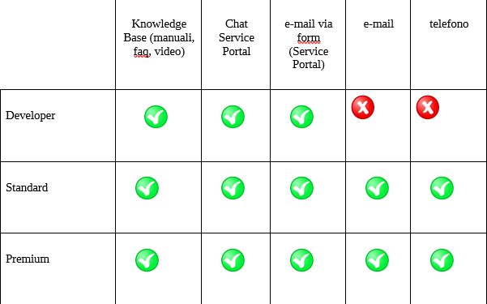

**Compliance Normativa e GDPR**
*******************************

**ISO 9001:2015**

La Certificazione assicura che il nostro sistema prevede la gestione
sistematica dei rischi e delle opportunità, il monitoraggio costante dei
processi aziendali per garantire standard di qualità, e il rispetto di
tempi e costi del servizio nell’ambito di:

-  progettazione, realizzazione, interconnessione, manutenzione,
   addestramento, gestione e conduzione operativa di **sistemi
   informativi automatizzati e di servizi informatici
   applicativi**, **infrastrutturali** **e di rete;**

-  progettazione e erogazione di **interventi formativi** e formazione
   sui servizi ICT erogati.

**ISO 27001:2013**

La certificazione assicura che il nostro sistema prevede alla gestione
della sicurezza delle informazioni per le attività di progettazione,
realizzazione, erogazione e supporto di servizi di facility management
per il data center e servizi di cloud computing.

**ISO 27017:2015**

La Certificazione assicura che il nostro Sistema è conforme alle
indicazioni e raccomandazioni sui controlli da effettuare per garantire
la sicurezza delle informazioni in ambito Cloud.

**ISO 27018:2014**

La Certificazione assicura che il nostro Sistema è conforme alle
direttive sulla tutela dei dati personali e quindi della privacy dei
clienti che affidano le loro informazioni a un servizio Cloud.

**ISO 20000-1:2018**

La Certificazione assicura che la nostra Organizzazione attua tutte le
best practices per stabilire, implementare, mantenere e migliorare un
sistema di gestione dei servizi, ovvero un framework di riferimento per
supportare il management nel ciclo di vita dell’erogazione dei servizi.

**ISO 22301:2012**

La Certificazione assicura che la nostra Organizzazione attua
comportamenti e raccomandazioni per migliorare la resilienza
organizzativa di fronte a eventi che possono compromettere il business
del CSI e la sua capacità di erogare prodotti/servizi.

**ISO 50001:2011**

La Certificazione assicura che il nostro Sistema di Gestione
dell’Energia è stato pianificato e applicato nel rispetto dei requisiti
legislativi cogenti in campo energetico ed è finalizzato a garantire
l'efficienza energetica dei processi produttivi promuovendo:

-  il risparmio energetico e la riduzione progressiva degli sprechi;

-  l'ottimizzazione degli attuali usi energetici, in particolare per ciò
   che riguarda il data center e il riscaldamento/condizionamento degli
   edifici;

-  una valutazione, nei processi di acquisto, degli aspetti relativi
   all'efficienza energetica.

**ANSI TIA 942 2017 Rating III**

La Certificazione assicura la capacità del nostro Data Center di
garantire la continuità dei servizi erogati. Il Rating III certifica che
il nostro Data Center è dotato di più sistemi di alimentazione e più
sistemi di raffreddamento. Tutti i componenti sono ridondati. La maggior
parte delle manutenzioni e degli aggiornamenti non richiedono di
portare `offline <https://it.wikipedia.org/wiki/Online_e_offline>`__ il
data center e l'uptime minimo è del 99,98% su base annua.

**Qualificazione CSP AGID – Cloud della PA**

La Qualificazione a CSP (Cloud Service Provider) della PA affidataci da
**AGID** ci posiziona agli occhi delle pubbliche amministrazioni come un
Cloud Provider competente e affidabile cui è possibile demandare servizi
cloud. La Qualifica assicura che nell’erogazione dei nostri servizi alla
pubblica amministrazione seguiamo tutti gli standard necessari per
offrire servizi digitali alla PA. Informazioni aggiuntive sono
visionabili nel Cloud Marketplace di AGID.

