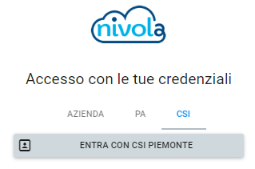
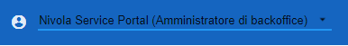

.. _Service_Portal:

**Il Service Portal**
=====================

    1. :ref:`Cosa è il Service Portal`
    2. :ref:`Accesso al Servizio`
    3. :ref:`Interfaccia Utente`

.. _Cosa è il Service Portal:

**Cosa è il Service Portal**
============================

Il Service Portal consiste nell’ area riservata di Nivola, che integra in un'unica interfaccia web tutte le funzionalità offerte dalla piattaforma cloud.
Il Service Portal mette a disposizione tutta la gamma di funzioni realizzate per creare, controllare e gestire in autonomia la propria infrastruttura cloud.
Attraverso un insieme di wizard grafici le virtual machine, i database e tutti i servizi offerti da Nivola sono utilizzabili in modo intuitivo e semplice da parte degli utenti, anche da chi non ha conoscenze tecniche specifiche. L’utente può tenere costantemente sotto controllo lo stato delle risorse tramite l’integrazione con i cruscotti di monitoraggio, le informazioni e i report sui costi e consumi, può creare nuovi servizi e mettersi in contatto con l’assistenza tramite più canali di comunicazione.

.. _Accesso al Servizio:

**Accesso al Servizio**
=======================

Per accedere al Service Portal di Nivola è necessario inserire, nel proprio browser, la seguente URL: https://portal.nivolapiemonte.it/.
L’accesso allo user portal avviene mediante autenticazione. Attualmente sono previste tre tipologie di autenticazione :

•	CSI (credenziali di CSI Piemonte)

•	Azienda . E’ possibile accedere utilizzando
    credenziali SPID o Sistema Piemonte per la pubblica amministrazione

.. image:: img/Azienda.png

•	PA. E’ possibile accedere utilizzando credenziali SPID o RUPAR.

.. image:: img/PA.png

.. _Interfaccia Utente:

**Interfaccia Utente**
======================

Dopo l’autenticazione all’utente viene presentata la propria Home Page personalizzata. I contenuti visualizzati
dipendono dal ruolo che riveste l’utente all’interno del Sistema.
La Home Page utente si distingue in 3 sezioni distinte.

1 – Barra di stato

.. image:: img/BarraStato.png

E’ posizionata in alto nel sistema, ed indica quale è l’utente e il profilo con
cui l’utente è loggato nel sistema.
L’utente, se ha altri ruoli associati,  può cambiare il profilo con cui agisce
all’interno del sistema. Premendo su

Viene presentato il
menu “Cambia profilo” con cui l’utente può modificare il proprio profilo

.. image:: img/Profilo.png

Permette all’utente di contattare l’assistenza via chat.

.. image:: img/Cornetta.png

Premere invece |.. image:: img/Cornetta.png| per accedere alla documentazione on line di
Nivola.

