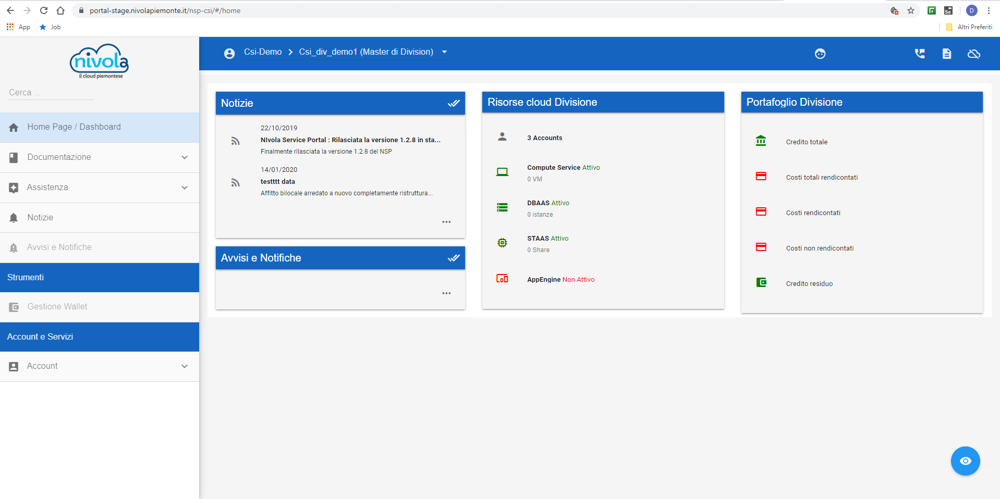

.. _Service_Portal:

**Il Service Portal**
=====================

Per utilizzare al portale è necessario avere una logine ed una password
valide.

Il **portale** della piattaforma **Nivola** mette a disposizione
degli user un insieme di funzionalità per creare dei servizi, gestirli
e controllarli.
La dashboard è formata da una **parte centrale** dove
è possibile scegliere il **ruolo**  e il livello
organizzativo con cui poter operare nella piattaforma. Proseguendo
nella descrizione, sempre nella parte centrale, il sistema presenta le informazioni
inerenti all'uso della piattaforma e alle eventuali comunicazioni riguardo
alle funzioni attive o a nuove soluzioni.

Nella parte sinistra sono state raggruuppate le funzioni utili al ruolo
come per esempio, la **gestione wallet** per un master della Divisione.
Sotto la voce **servizi** sono state inserite le funzioni afferenti agli oggetti
istanziati o che si intendono creare.

I passaggi che normalmente si fanno durante l'uso del portale prevedono:

1) Accreditarmento.
2) Scelta del binomio Ruolo e Livello Organizzativo.
3) Utilizzo servizi della piattaforma.

**Descrizione di alto livello, Spiegare modalità di accesso, servizi disponibili,
confgiurabilità della dashboard,
selezione dell'account,
etc…Ogni citazione di funzionalità va referenziata e linkata.**