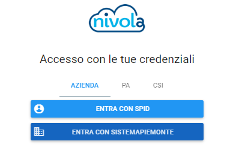
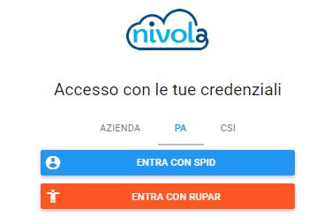
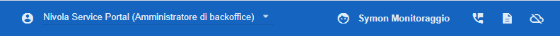
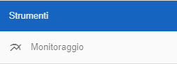
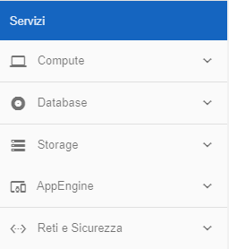
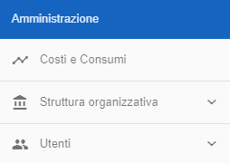
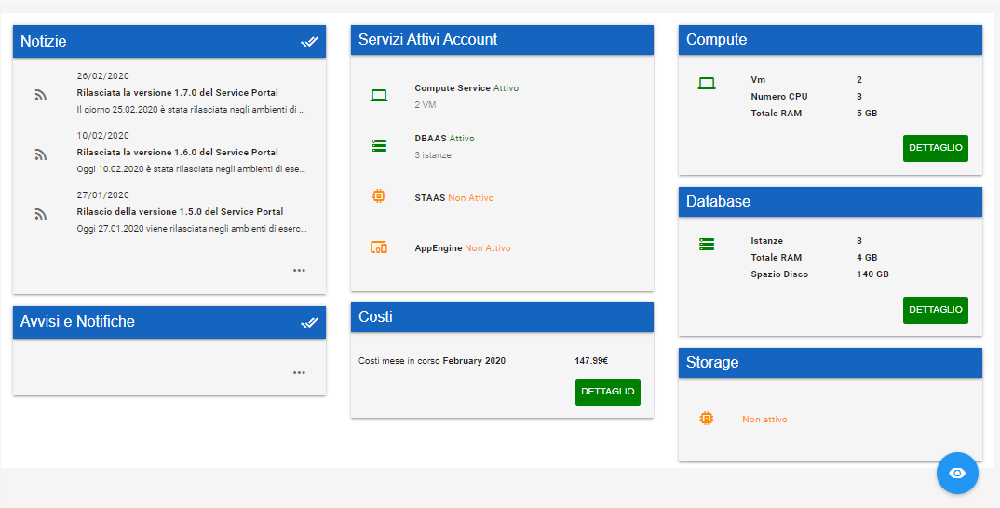
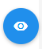
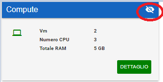

.. _Service_Portal:

**Il Service Portal**
=====================

-  **Cosa è il SP**

-  **Accesso al Servizio**

-  **Interfaccia utente**

**Cosa è il SP**

Il Nivola Service Portal (NSP) costituisce l'Area Riservata per i clienti ed
integra in un'interfaccia web tutte le funzionalità offerte della
piattaforma. Mette a disposizione tutta la gamma di funzioni realizzate
per creare, controllare e gestire in autonomia i propri servizi cloud.

Attraverso un insieme di wizard grafici semplici ed intuitivi tutti i servizi
offerti da Nivola sono utilizzabili  da
parte degli utenti, anche da chi non possiede competenze tecniche specifiche.
L’utente può tenere costantemente sotto controllo lo stato
delle risorse tramite l’integrazione con i cruscotti di monitoraggio, le
informazioni e i report sui costi e consumi, può creare nuovi servizi e
mettersi con il *Nivola Support Center* utilizzando
differenti canali di comunicazione.

**Accesso al Servizio**

Terminata la fase di accreditamento, per accedere al Nivola Service Portal
è sufficiente collegarsi all'URL  https://portal.nivolapiemonte.it/ con
le proprie credenziali scegliendo tra i seguenti sistemi di autenticazione:

1.	SPID
2.	CIE - Carte di Identità Elettronica
3.	TS-CNS - Sistema Tessere Sanitaria
4.	PSNet
5.	Sistema Piemonte

Indipendentemente dal sistema di autenticazione scelto dall'utente,
il Nivola Service Portal procederà a

1.	ridirigere l'utente verso l'Identity Provider corretto per la verifica delle credenziali
2.	ricavare il Codice Fiscale dell'utente
3.	autorizzare l'accesso alla piattaforma Nivola  in base al proprio profilo

Questa è la finestra che viene presentata all'utente al momento dell'accesso:

   |image0|

In funzione della tipologia di Cliente, l'utente potrà scegliere tra

•	Azienda, per le Imprese
•	PA, per i clienti Pubblica Amministrazione
•	CSI, per il personale CSI Piemonte

-  Azienda . E’ possibile accedere utilizzando credenziali SPID o
      Sistema Piemonte per la pubblica amministrazione.

..

   |image1|

-  PA. E’ possibile accedere utilizzando credenziali SPID o RUPAR.

..

   |image2|

**Interfaccia utente**

Dopo :ref:`l'autenticazione <Processo di Accredito>` all’utente viene presentata la propria Home Page
personalizzata. I contenuti visualizzati dipendono dal ruolo che riveste
l’utente all’interno del Sistema.

La Home Page utente si distingue in 3 sezioni distinte.

**1 – Barra di stato**

|image3|

E’ posizionata in alto nel sistema, ed indica quale è l’utente e il
profilo con cui l’utente è loggato nel sistema.

L’utente, se ha altri ruoli associati, può cambiare il profilo con cui
agisce all’interno del sistema. Premendo su

|image4|

Viene presentato il menu “Cambia profilo” con cui l’utente può
modificare il proprio profilo.

|image5|

|image6| Permette all’utente di contattare l’assistenza via chat.

Premere invece |image7| per accedere alla documentazione on line di
Nivola.

Per uscire dal sistema e chiudere la sessione di lavoro premere il
simbolo |image8|

**2- Menu di navigazione**

Il menù laterale di sinistra contiene l’elenco dei servizi che l’utente
può consultare e utilizzare in base al proprio profilo.

Il menù di navigazione è composto da più sezioni in base alla tipologia
dei servizi.

La prima sezione

|image9|

permette di accedere a tutto il materiale informativo su Nivola tramite
la voce “Documentazione”, permette di contattare l’assistenza tramite la
voce “Assistenza” e di avere il dettaglio delle notizie e delle
informazioni sulla piattaforma tramite “Notizie”.

La sezione “Strumenti”

|image10|

Contiene le voci di menu per poter accedere agli strumenti offerti dalla
piattaforma ai suoi utenti. Da qui si potrà accedere ad esempio alle
console di monitoraggio oppure ai sistemi di visualizzazione dei log.

La sezione “Servizi” è il menu dei Servizi offerti dalla piattaforma
Nivola. In questa voce l’utente troverà l’elenco di tutti i servizi su
cui può operare all’interno di Nivola per crearsi le proprie risorse
Cloud.

|image11|

Nella Sezione “Amministrazione” vengono rese disponibili tutte quelle
voci che permettono all’utente di gestire, in base al proprio profilo,
la profilazione e l’accreditamento utente, oppure può visualizzare i
dettagli della propria struttura organizzativa e accedere alle pagine di
dettaglio dei costi e consumi del proprio Cloud.

|image12|

**3 - Home Page**

E’ la pagina iniziale presentata all’utente della piattaforma. E’
composta da un insieme di dashboard dinamiche visualizzate di default in
base al profilo con cui si accede. Tramite questa home page l’utente può
vedere in sintesi i consumi e lo stato dei propri servizi e consultare
le ultime notizie pubblicate.

|image13|

La Home Page è personalizzabile dall’utente che può impostarne la
visualizzazione e la disposizione delle dashboard in base alle sue
preferenze o priorità.

Per attivare la modalità di modifica della Home Page premere

|image14|

A questo punto sarà possibile:

-  Disabilitare la visualizzazione di una dashboard. Per fare questo
   premere il simbolo evidenziato presente nella dashboard che vi vuole
   non più visualizzare in quanto non di interesse

|image15|

-  Spostare la dashboard all’interno del riquadro della HomePage. Per
   far questo tenere premuto il mouse sulla barra blu della dashboard e
   spostarla all’interno dell’area di lavoro. Rilasciare il mouse dopo
   aver definito la nuova posizione.

Per confermare le modifiche alla disposizione impostata è rendere
effettiva la Home Page personalizzata è necessario premere

|image16|

.. |image0| image:: img/image0.png

.. |image4| image:: img/image4.png

.. |image6| image:: img/image6.png

.. |image9| image:: img/image9.png

   
   
   
   
   
   
   
   